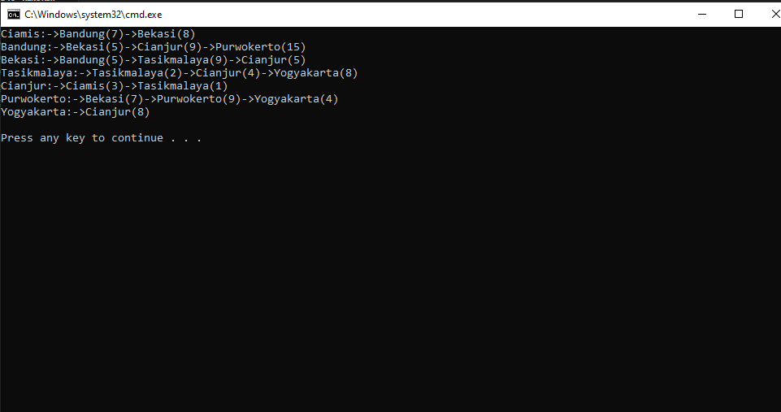
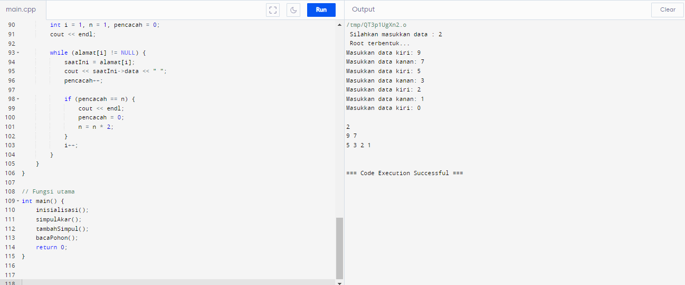
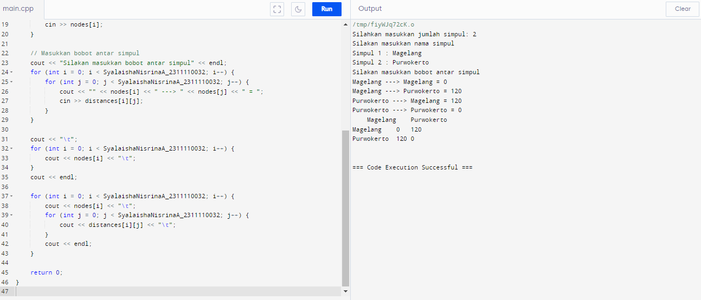
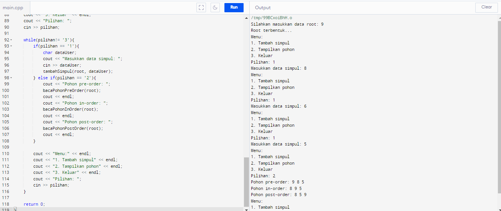

# <h1 align="center">Laporan Praktikum Modul Graph dan Tree
</h1>
<p align="center">Syalaisha Nisrina Anataya</p>

## Dasar Teori

### A. GRAPH
Graf adalah sebuah struktur yang terdiri dari sekumpulan objek di mana beberapa pasangan dari objek-objek tersebut berhubungan. Sebenarnya, kita perlu sedikit memperluas definisi ini untuk multi-set, karena objek yang sama dapat secara sintaksis dan semantik muncul beberapa kali dalam grafik kita.

Jenis jenis graph: 
a. Graf Tidak Berarah (Undirected Graph): Pada graf tak berarah, sisi-sisi tidak memiliki arah yang terkait dengannya. Ini berarti bahwa hubungan antara node adalah simetris, dan jika ada sisi dari node A ke node B, ada juga sisi dari node B ke node A.

b. Graf Berarah (Digraph): Dalam graf berarah, sisi-sisi memiliki arah yang terkait dengannya. Ini berarti bahwa hubungan antar node tidak simetris, dan jika ada sisi dari node A ke node B, itu tidak menyiratkan adanya sisi dari node B ke node A.

c. Graf Berarah (Digraph): Dalam graf berarah, sisi-sisi memiliki arah yang terkait dengannya. Ini berarti bahwa hubungan antar node tidak simetris, dan jika ada sisi dari node A ke node B, itu tidak menyiratkan adanya sisi dari node B ke node A.

d. Graf Lengkap: Graf lengkap adalah sebuah graf yang memiliki sebuah sisi di antara setiap pasangan simpul yang berbeda. Dengan kata lain, semua simpul dalam graf lengkap terhubung satu sama lain.

e. Graf bipartit adalah sebuah graf yang simpul-simpulnya dapat dibagi menjadi dua himpunan yang terpisah sehingga tidak ada sisi antara simpul-simpul di dalam himpunan yang sama, tetapi ada sisi antara simpul-simpul di dalam himpunan yang berbeda.

f. Graf siklik adalah sebuah graf yang mengandung setidaknya satu siklus, yaitu sebuah lintasan yang berawal dan berakhir pada simpul yang sama.

g. Graf asiklik adalah graf yang tidak mengandung siklus apa pun.Pohon adalah contoh umum dari graf asiklik.

h. Graf terhubung adalah sebuah graf yang memiliki jalur di antara setiap pasangan simpul. Dengan kata lain, semua node pada graf terhubung dapat dijangkau dari setiap node lainnya.

### B. TREE
Tree adalah struktur data yang banyak digunakan yang terdiri dari simpul-simpul yang dihubungkan oleh sisi-sisi. Pohon adalah struktur hirarkis di mana setiap simpul memiliki simpul induk (kecuali simpul akar) dan nol atau lebih simpul anak. Node teratas dari sebuah pohon disebut root node, dan merupakan titik awal untuk menelusuri pohon tersebut.

Karakteristik utama dari tree : 
1. Akar (Root): Simpul paling atas dalam pohon, di mana semua simpul lain berasal.
2. Orang Tua (Parent): Simpul yang memiliki satu atau lebih simpul anak.
3. Anak (Child): Simpul yang terhubung langsung ke simpul orang tua.
4. Daun (Leaf): Simpul yang tidak memiliki simpul anak.
5. Simpul Internal (Internal Node): Simpul yang memiliki setidaknya satu simpul anak.
6. Subpohon (Subtree): Bagian dari pohon yang juga merupakan pohon, terdiri dari simpul dan semua keturunannya.
7. Kedalaman (Depth): Jarak dari simpul ke akar, dengan akar memiliki kedalaman 0.
8. Ketinggian (Height): Jarak terpanjang dari simpul ke simpul daun terdekat.

## Guided 
### Guided 1 : 
```C++
#include<iostream>
#include<iomanip>
using namespace std;

string simpul[7] = {"Ciamis", "Bandung", "Bekasi","Tasikmalaya","Cianjur", "Purwokerto", "Yogyakarta"};

int busur [7][7] = {
    {0,7,8,0,0,0,0},
    {0,0,5,0,9,15,0},
    {0,5,0,9,5,0,0},
    {0,0,0,2,4,0,8},
    {3,0,0,1,0,0,0},
    {0,0,7,0,0,9,4},
    {0,0,0,0,8,0,0},
};

void tampilgraph(){
    for (int baris = 0 ; baris < 7 ; baris++ ){
        cout << simpul [baris] << ":";
        for (int kolom = 0; kolom < 7 ; kolom++) {
            if (busur [baris][kolom]!=0)
            cout << "->" << simpul[kolom] << "(" << busur[baris][kolom] << ")";
        }
        cout << endl;
    } 
}

int main(){
    tampilgraph();
    return 0;
}
```
Kode program diatas adalah salah satu implementasi dari graph. Program ini mendeklarasikan  dua variabel global, yaitu `simpul` dan `busur`. `simpul` adalah array yang berisi nama-nama kota, sedangkan `busur` adalah matriks 2D yang merepresentasikan hubungan antara kota-kota tersebut. Kemudian fungsi `tampilgraph()` untuk mencetak graph dengan melakukan iterasi pada setiap simpul (kota).Kemudian, fungsi ini melihat setiap busur yang keluar dari simpul tersebut (dengan melihat setiap elemen di baris matriks yang sesuai dengan simpul tersebut). Jika elemen matriks tidak nol, itu berarti ada busur(jarak) yang menghubungkan simpul tersebut dengan simpul lain. Fungsi ini kemudian mencetak nama simpul tujuan dan jaraknya.Proses ini diulangi untuk setiap simpul dalam graf.
#### Output : 


### Guided 2 : 
```C++
#include<iostream>

using namespace std;

 struct pohon{
    pohon* kanan;
    char data;
    pohon*kiri;
 };

 // Deklarasi  variabel global 
 pohon* simpul;
 pohon* root;
 pohon* saatIni;
 pohon* helperA;
 pohon* helperB;
 pohon* alamat[256];

// Fungsi untuk inisialisasi root
 void inisialisasi(){
    root = NULL ;
 }

 void simpulBaru (char DataMasukkan ){
    simpul = new pohon;
    simpul -> data = DataMasukkan;
    simpul -> kanan = NULL;
    simpul -> kiri = NULL;
 }

 void simpulAkar(){
    if(root == NULL){
        char dataAnda;
        cout << " Silahkan masukkan data : ";
        cin >> dataAnda;
        simpulBaru(dataAnda);
        root = simpul;
        cout << " Root terbentuk... "<< endl ;
    } else {
        cout<< " Root sudah ada... " << endl;
    }
 }
 // Fungsi untuk menambah simpul
void tambahSimpul() {
    if (root != NULL) {
        int i = 1, j = 1, penanda = 0;
        char dataUser;
        alamat[i] = root;

        while (penanda == 0 && j < 256) {
            cout << "Masukkan data kiri: ";
            cin >> dataUser;

            if (dataUser != '0') {
                simpulBaru(dataUser);
                saatIni = alamat[i];
                saatIni->kiri = simpul;
                j++;
                alamat[j] = simpul;
            } else {
                penanda = 1;
                j++;
                alamat[j] = NULL;
            }

            if (penanda == 0) {
                cout << "Masukkan data kanan: ";
                cin >> dataUser;

                if (dataUser != '0') {
                    simpulBaru(dataUser);
                    saatIni = alamat[i];
                    saatIni->kanan = simpul;
                    j++;
                    alamat[j] = simpul;
                } else {
                    penanda = 1;
                    j++;
                    alamat[j] = NULL;
                }
            }
            i++;
        }
    }
}

// Fungsi untuk membaca pohon
void bacaPohon() {
    if (root != NULL) {
        int i = 1, n = 1, pencacah = 0;
        cout << endl;

        while (alamat[i] != NULL) {
            saatIni = alamat[i];
            cout << saatIni->data << " ";
            pencacah++;

            if (pencacah == n) {
                cout << endl;
                pencacah = 0;
                n = n * 2;
            }
            i++;
        }
    }
}

// Fungsi utama
int main() {
    inisialisasi();
    simpulAkar();
    tambahSimpul();
    bacaPohon();
    return 0;
}
```
Program ini mendeklarasikan struktur `pohon` yang memiliki tiga variabel: `kanan`, `data`, dan `kiri`. `kanan` dan `kiri` adalah pointer ke simpul kanan dan kiri dari simpul saat ini, sedangkan `data` adalah data yang disimpan dalam simpul. Kemudian ideklarasikan juga beberapa variabel global seperti `simpul`, `root`, `saatIni`, `helperA`, `helperB`, dan `alamat`. `simpul` digunakan untuk menyimpan simpul baru yang dibuat, `root` adalah simpul akar dari pohon, `saatIni` adalah simpul yang sedang diproses, `helperA` dan `helperB` adalah variabel bantuan, dan `alamat` adalah array yang digunakan untuk menyimpan alamat dari setiap simpul dalam pohon.

Beberapa fungsi yang digunakan dalam program ini adalah : 

- Fungsi `inisialisasi()` untuk menginisialisasi `root` dengan `NULL`, yang artinya pohon saat ini masih kosong.
- Fungsi `simpulBaru(char DataMasukkan)` untuk membuat simpul baru dengan data yang diberikan oleh pengguna. Simpul baru ini tidak memiliki anak kiri atau kanan, yang yang artinya merupakan simpul daun.
- Fungsi `simpulAkar()` untuk membuat simpul akar jika belum ada. Jika sudah ada, fungsi ini akan mencetak pesan bahwa akar sudah ada. 
- Fungsi `tambahSimpul()`untuk menambahkan simpul ke pohon. Fungsi ini meminta pengguna memasukkan data untuk simpul kiri dan kanan dari setiap simpul yang ada. Jika pengguna memasukkan '0', maka tidak ada simpul yang ditambahkan. Fungsi ini menggunakan array `alamat` untuk menyimpan alamat dari setiap simpul yang ditambahkan.
- Fungsi `bacaPohon()`untuk mencetak data dari setiap simpul dalam pohon. Fungsi ini mencetak data dalam urutan level (dari atas ke bawah, kiri ke kanan). Fungsi ini juga menggunakan array `alamat` untuk mengakses setiap simpul dalam pohon.

Secara keseluruhan, program ini memungkinkan pengguna untuk membuat pohon biner dengan data yang diinput oleh user, dan kemudian menampilkan data dari setiap simpul dalam pohon tersebut dalam urutan level.

#### Output : 



## Unguided 
### 1.  Buatlah program graph dengan menggunakan inputan user untuk menghitung jarak dari sebuah kota ke kota lainnya.
```C++
#include <iostream>
#include <string>
#include <vector>

using namespace std;

int main() {
    int SyalaishaNisrinaA_2311110032;
    cout << "Silahkan masukkan jumlah simpul: ";
    cin >> SyalaishaNisrinaA_2311110032;

    vector<string> nodes(SyalaishaNisrinaA_2311110032);
    vector<vector<int>> distances(SyalaishaNisrinaA_2311110032, vector<int>(SyalaishaNisrinaA_2311110032));

    // Masukkan nama simpul
    cout << "Silakan masukkan nama simpul" << endl;
    for (int i = 0; i < SyalaishaNisrinaA_2311110032; i++) {
        cout << "Simpul " << i + 1 << " : ";
        cin >> nodes[i];
    }

    // Masukkan bobot antar simpul
    cout << "Silakan masukkan bobot antar simpul" << endl;
    for (int i = 0; i < SyalaishaNisrinaA_2311110032; i++) {
        for (int j = 0; j < SyalaishaNisrinaA_2311110032; j++) {
            cout << "" << nodes[i] << " ---> " << nodes[j] << " = ";
            cin >> distances[i][j];
        }
    }

    cout << "\t";
    for (int i = 0; i < SyalaishaNisrinaA_2311110032; i++) {
        cout << nodes[i] << "\t";
    }
    cout << endl;

    for (int i = 0; i < SyalaishaNisrinaA_2311110032; i++) {
        cout << nodes[i] << "\t";
        for (int j = 0; j < SyalaishaNisrinaA_2311110032; j++) {
            cout << distances[i][j] << "\t";
        }
        cout << endl;
    }

    return 0;
}
```
Kode program diatas adalah implementasi graph dengan menggunakan inputan. Program ini mendeklarasikan beberapa variabel, yaitu `SyalaishaNisrinaA_2311110032`, `nodes`, dan `distances`. `SyalaishaNisrinaA_2311110032` digunakan untuk menyimpan jumlah simpul. `nodes` adalah vektor yang berisi nama-nama simpul, sedangkan `distances` adalah matriks 2D yang merepresentasikan bobot antar simpul. Kemudian Input Nama Simpul yang akan meinta pengguna memasukkan nama simpul dan menyimpannya dalam vektor `nodes`. Selanjutnya Input Bobot Antar Simpul yang akan meminta pengguna memasukkan bobot antar simpul (jarak) dan menyimpannya dalam matriks `distances`. Yang terakhir program akan mencetak graf dalam bentuk matriks adjacensi. Baris dan kolom matriks ini merepresentasikan simpul, dan elemen matriks merepresentasikan bobot(jarak) antar simpul.

#### Output : 


### 2.  Modifikasi guided tree diatas dengan program menu menggunakan input data tree dari user dan tampilkan pada pre-order, inorder, dan post order!
```C++
#include<iostream>

using namespace std;

struct pohon{
    pohon* kanan;
    char data;
    pohon* kiri;
};

// Deklarasi variabel global
pohon* root;
pohon* simpul;

// Fungsi untuk inisialisasi root
void inisialisasi(){
    root = NULL;
}

void simpulBaru(char DataMasukkan){
    simpul = new pohon;
    simpul->data = DataMasukkan;
    simpul->kanan = NULL;
    simpul->kiri = NULL;
}

void simpulAkar(){
    if(root == NULL){
        char dataAnda;
        cout << "Silahkan masukkan data root: ";
        cin >> dataAnda;
        simpulBaru(dataAnda);
        root = simpul;
        cout << "Root terbentuk..." << endl;
    } else {
        cout << "Root sudah ada..." << endl;
    }
}

// Fungsi untuk menambah simpul
void tambahSimpul(pohon* node, char dataUser){
    if(dataUser!= '0'){
        simpulBaru(dataUser);
        if(node->kiri == NULL){
            node->kiri = simpul;
        } else {
            node->kanan = simpul;
        }
    }
}

// Fungsi untuk membaca pohon pre-order
void bacaPohonPreOrder(pohon* node){
    if(node!= NULL){
        cout << node->data << " ";
        bacaPohonPreOrder(node->kiri);
        bacaPohonPreOrder(node->kanan);
    }
}

// Fungsi untuk membaca pohon in-order
void bacaPohonInOrder(pohon* node){
    if(node!= NULL){
        bacaPohonInOrder(node->kiri);
        cout << node->data << " ";
        bacaPohonInOrder(node->kanan);
    }
}

// Fungsi untuk membaca pohon post-order
void bacaPohonPostOrder(pohon* node){
    if(node!= NULL){
        bacaPohonPostOrder(node->kiri);
        bacaPohonPostOrder(node->kanan);
        cout << node->data << " ";
    }
}

// Fungsi utama
int main(){
    inisialisasi();
    simpulAkar();

    char pilihan;
    cout << "Menu:" << endl;
    cout << "1. Tambah simpul" << endl;
    cout << "2. Tampilkan pohon" << endl;
    cout << "3. Keluar" << endl;
    cout << "Pilihan: ";
    cin >> pilihan;

    while(pilihan!= '3'){
        if(pilihan == '1'){
            char dataUser;
            cout << "Masukkan data simpul: ";
            cin >> dataUser;
            tambahSimpul(root, dataUser);
        } else if(pilihan == '2'){
            cout << "Pohon pre-order: ";
            bacaPohonPreOrder(root);
            cout << endl;
            cout << "Pohon in-order: ";
            bacaPohonInOrder(root);
            cout << endl;
            cout << "Pohon post-order: ";
            bacaPohonPostOrder(root);
            cout << endl;
        }

        cout << "Menu:" << endl;
        cout << "1. Tambah simpul" << endl;
        cout << "2. Tampilkan pohon" << endl;
        cout << "3. Keluar" << endl;
        cout << "Pilihan: ";
        cin >> pilihan;
    }

    return 0;
}
```
Program ini mendeklarasikan struktur `pohon` yang memiliki tiga variabel: `kanan`, `data`, dan `kiri`. `kanan` dan `kiri` adalah pointer ke simpul kanan dan kiri dari simpul saat ini, sedangkan `data` adalah data yang disimpan dalam simpul. Kemudian program ini juga mendeklarasikan beberapa variabel global `root` dan `simpul`. `root` adalah simpul akar dari pohon dan `simpul` digunakan untuk menyimpan simpul baru yang dibuat. 

Beberapa fungsi yang digunakan dalam program sama dengan yan terdapat pada guided2, tetapi ada tambahan yaitu Fungsi `tambahSimpul(pohon* node, char dataUser)` dan Fungsi `bacaPohonPreOrder(pohon* node)`, `bacaPohonInOrder(pohon* node)`, serta`bacaPohonPostOrder(pohon* node)`. Fungsi `tambahSimpul()` untuk menambahkan simpul ke pohon. Fungsi ini memeriksa apakah data pengguna bukan '0'. Jika bukan, maka fungsi ini akan membuat simpul baru dan menambahkannya ke simpul kiri dari simpul saat ini jika simpul kiri belum ada. Jika simpul kiri sudah ada, maka simpul baru akan ditambahkan ke simpul kanan. Sedangkan Fungsi `bacaPohonPreOrder()`, `bacaPohonInOrder()`, dan `bacaPohonPostOrder()` untuk mencetak data dari setiap simpul dalam pohon dengan urutan yang berbeda. `bacaPohonPreOrder` mencetak data dalam urutan pre-order (akar, kiri, kanan), `bacaPohonInOrder` mencetak data dalam urutan in-order (kiri, akar, kanan), dan `bacaPohonPostOrder` mencetak data dalam urutan post-order (kiri, kanan, akar).

#### Output : 


## Kesimpulan 
Dari Modul 10 tentang Graph dan Tree ini, dapat diambil beberapa kesimpulan yaitu:
1. Graph adalah Struktur data yang terdiri dari simpul (vertex) dan sisi (edge), digunakan untuk merepresentasikan hubungan antar objek. Graph dapat berupa directed, undirected, atau weighted.

2. Representasi Graph: Dapat dilakukan dengan menggunakan matriks atau linked list. Penting untuk memperhatikan perbedaan antara simpul vertex dan simpul edge 

3. Tree adalah Struktur data hirarkis yang terdiri dari node dengan satu simpul induk dan beberapa simpul anak. Binary tree adalah jenis tree di mana setiap node memiliki maksimal dua anak.

4. Operasi Tree:  create, clear, isEmpty, insert, find, update, retrive, delete sub, characteristic, dan traverse dengan metode Pre-Order, In-Order, dan Post-Order.


## Referensi
[1] Fensel, D., Şimşek, U., Angele, K., Huaman, E., Kärle, E., Panasiuk, O., ... & Wahler, A. (2020). Introduction: what is a knowledge graph?. Knowledge graphs: Methodology, tools and selected use cases, 1-10.

[2] Beaini, D., Passaro, S., Létourneau, V., Hamilton, W., Corso, G., & Liò, P. (2021, July). Directional graph networks. In International Conference on Machine Learning (pp. 748-758). PMLR.

[3] Mathur, U., Pavlogiannis, A., Tunç, H. C., & Viswanathan, M. (2022, February). A tree clock data structure for causal orderings in concurrent executions. In Proceedings of the 27th ACM International Conference on Architectural Support for Programming Languages and Operating Systems (pp. 710-725).


