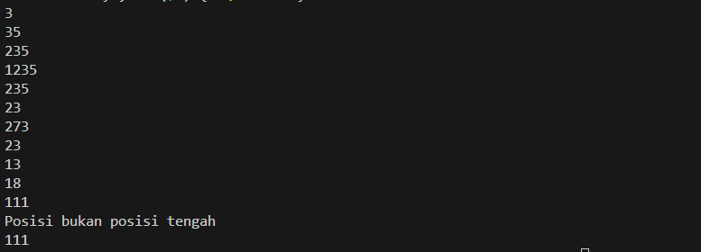

# <h1 align="center">Laporan Praktikum Modul Linked List</h1>
<p align="center">Syalaisha Nisrina Anataya</p>

## Dasar Teori
Struktur data adalah cara penyimpanan, penyusunan dan pengaturan data di dalam media penyimpanan komputer 
sehingga data tersebut dapat digunakan secara efisien. Dalam teknik pemrograman, struktur data berarti tata letak data 
yang berisi kolom-kolom data, baik itu kolom yang tampak oleh pengguna (user) atau pun kolom yang hanya 
digunakan untuk keperluan pemrograman yang tidak tampak oleh pengguna[1].
### 1. Single Linked List
Singly Linked List adalah struktur data yang terdiri dari sekumpulan node di mana setiap node memiliki dua bagian: satu bagian menyimpan data dan bagian lainnya adalah referensi ke node berikutnya dalam urutan. Operasi utama yang dapat dilakukan penambahan (insertion), penghapusan (deletion), dan pencarian (searching) elemen. Keuntungannya adalah fleksibilitas dalam pengelolaan memori karena elemen dapat dengan mudah ditambahkan atau dihapus tanpa perlu mengalokasikan memori secara berurutan. Singly Linked List sering digunakan dalam aplikasi yang memerlukan penyimpanan dan manipulasi data secara dinamis, seperti manajemen memori dan implementasi stack atau queue[1].

### 2. Double Linked List
Doubly Linked List adalah bagian dari struktur data linier majemuk, di mana setiap elemen memiliki referensi ke elemen sebelum dan sesudahnya, memungkinkan navigasi dua arah. Hal ini tidak dijelaskan secara detail di halaman ini, tetapi konsepnya termasuk dalam kategori struktur data linier majemuk[1]. 

Keuntungan : 
- Memungkinkan navigasi daftar ke arah depan dan belakang dengan mudah,
- Memudahkan operasi penyisipan dan penghapusan node di tengah daftar,
- Memungkinkan implementasi stack dan queue yang lebih efisien [2][3].

Kekurangan :
- Membutuhkan lebih banyak memori dibandingkan SLL karena adanya pointer prev,
- Operasi penyisipan dan penghapusan node sedikit lebih kompleks dibandingkan SLL,[2][3].

## Guided 
### 1. Latihan Single Linked List
```C++
#include <iostream>
using namespace std;

//Deklarasi Struct Node
struct Node{
    //komponen/member
    int data;
    Node *next;
};
    Node *head;
    Node *tail;
//Inisialisasi Node
void init(){
    head = NULL;
    tail = NULL;
}
// Pengecekan
bool isEmpty(){
    if (head == NULL)
    return true;
    else
    return false;
}
//Tambah Depan
void insertDepan(int nilai){
    //Buat Node baru
    Node *baru = new Node;
    baru->data = nilai;
    baru->next = NULL;
    if (isEmpty() == true){
        head = tail = baru;
        tail->next = NULL;
    }
    else{
        baru->next = head;
        head = baru;
    }
}
//Tambah Belakang
void insertBelakang(int nilai){
    //Buat Node baru
    Node *baru = new Node;
    baru->data = nilai;
    baru->next = NULL;
    if (isEmpty() == true){
        head = tail = baru;
        tail->next = NULL;
    }
    else{
    tail->next = baru;
    tail = baru;
    }
}
//Hitung Jumlah List
int hitungList(){
    Node *hitung;
    hitung = head; // dimulai dari head
    int jumlah = 0;
    while( hitung != NULL ){
        jumlah++;
        hitung = hitung->next;
    }
    return jumlah;
}
//Tambah Tengah
void insertTengah(int data, int posisi){
    if( posisi < 1 || posisi > hitungList() ){
        cout << "Posisi diluar jangkauan" << endl;
    }
    else if( posisi == 1){
        cout << "Posisi bukan posisi tengah" << endl;
    }
    else{
        Node *baru, *bantu;
        baru = new Node();
        baru->data = data;
        // tranversing
            bantu = head;
            int nomor = 1;
        while( nomor < posisi - 1 ){
            bantu = bantu->next;
            nomor++;
        }
        baru->next = bantu->next;
        bantu->next = baru;
    }
}
//Hapus Depan
void hapusDepan() {
    Node *hapus;
    if (isEmpty() == false){
        if (head->next != NULL){
            hapus = head;
            head = head->next;
            delete hapus;
        }
        else{
            head = tail = NULL;
        }
    }
    else{
        cout << "List kosong!" << endl;
    }
}
//Hapus Belakang
void hapusBelakang() {
    Node *hapus;
    Node *bantu;
    if (isEmpty() == false){
        if (head != tail){
            hapus = tail;
            bantu = head;
            while (bantu->next != tail){
                bantu = bantu->next;
            }
            tail = bantu;
            tail->next = NULL;
        delete hapus;
        }
        else{
            head = tail = NULL;
        }
    }
    else{
        cout << "List kosong!" << endl;
    }
}
//Hapus Tengah
void hapusTengah(int posisi){
    Node *hapus, *bantu, *bantu2;
    if( posisi < 1 || posisi > hitungList() ){
        cout << "Posisi di luar jangkauan" << endl;
    }
    else if( posisi == 1){
        cout << "Posisi bukan posisi tengah" << endl;
    }
    else{
        int nomor = 1;
        bantu = head;
        while( nomor <= posisi ){
            if( nomor == posisi-1 ){
                bantu2 = bantu;
            }
            if( nomor == posisi ){
                hapus = bantu;
            }
            bantu = bantu->next;
            nomor++;
        }
        bantu2->next = bantu;
    delete hapus;
    }
}
//Ubah Depan
void ubahDepan(int data){
    if (isEmpty() == false){
        head->data = data;
    }
    else{
        cout << "List masih kosong!" << endl;
    }
}
//Ubah Tengah
void ubahTengah(int data, int posisi){
    Node *bantu;
    if (isEmpty() == false){
        if( posisi < 1 || posisi > hitungList() ){
            cout << "Posisi di luar jangkauan" << endl;
        }
        else if( posisi == 1){
            cout << "Posisi bukan posisi tengah" << endl;
        }
        else{
            bantu = head;
            int nomor = 1;
            while (nomor < posisi){
                bantu = bantu->next;nomor++;
            }
            bantu->data = data;
        }
    }
    else{
        cout << "List masih kosong!" << endl;
    }
}
//Ubah Belakang
void ubahBelakang(int data){
    if (isEmpty() == false){
        tail->data = data;
    }
    else{
        cout << "List masih kosong!" << endl;
    }
}
//Hapus List
void clearList(){
    Node *bantu, *hapus;
    bantu = head;
    while (bantu != NULL){
        hapus = bantu;
        bantu = bantu->next;
        delete hapus;
    }
    head = tail = NULL;
    cout << "List berhasil terhapus!" << endl;
}
//Tampilkan List
void tampil(){
    Node *bantu;
    bantu = head;
    if (isEmpty() == false){
        while (bantu != NULL){
            cout << bantu->data << ends;
            bantu = bantu->next;
        }
        cout << endl;
    }
    else{
        cout << "List masih kosong!" << endl;
    }
}
int main(){
    init();
    insertDepan(3); //Karena baru diinput 3 akan menjadi head
    tampil();
    insertBelakang(5);
    tampil();
    insertDepan(2);
    tampil();
    insertDepan(1);
    tampil();
    hapusDepan();
    tampil();
    hapusBelakang();
    tampil();
    insertTengah(7,2); //Data yang dimasukkan = 7, 2 = posisi berapa data akan diselipkan
    tampil();
    hapusTengah(2);
    tampil();
    ubahDepan(1);
    tampil();
    ubahBelakang(8);
    tampil();
    ubahTengah(11, 2);
    tampil();

    insertTengah(7,1); 
    tampil();
    return 0;
}
```
Kode program merepresentasikan atribut `data`dan `next` oleh *Struct Node*. Beberapa fungsi yang digunakan yaitu 
- Fungsi `init()` untuk menginisialisasi head dan tail list
- Fungsi`isEmpty()` untuk mengecek apakah list kosong atau tidak. 
- Fungsi `insertDepan(3)` dan `insertBelakang(5)` digunakan untuk menambahkan node baru ke awal yaitu 3 dan akhir list dengan nilai data 5.
- Fungsi `hitungList()` untuk menghitung jumlah node dalam list. 
- Fungsi `insertTengah(7,1)` untuk penambahan node baru ke posisi tertentu dalam list. Akan tetapi, pada kode didefinisikan bawa nilai yang akan dimasukkan adalah 7 pada posisi ke 1. Hal itu tidak bisa dilakukan.
- Fungsi `hapusDepan()`, `hapusBelakang()` untuk menghapus node pertama, terakhir, sedangkan `hapusTengah(1)` dan node pada posisi ke 1 dalam list. 
- Fungsi `ubahDepan(1)`, `ubahTengah(11,2)`, dan `ubahBelakang(8)` untuk mengubahan data pada node pertama, node di posisi 2 dengan 11, dan node terakhir dengan 8.
- Fungsi `clearList()`  untuk menghapus semua node dalam list, dan `tampil()`  untuk mencetak semua data dalam list.

#### Output : 
![Guided1]

### 2. Latihan Double Linked List

```C++
#include <iostream>
using namespace std;

class Node {
    public:int data;
    Node* prev;
    Node* next;
};
class DoublyLinkedList {
        public:
        Node* head;
        Node* tail;
        DoublyLinkedList() {
            head = nullptr;
            tail = nullptr;
    }
    void push(int data) {
        Node* newNode = new Node;
        newNode->data = data;
        newNode->prev = nullptr;
        newNode->next = head;
        if (head != nullptr) {
            head->prev = newNode;
        } 
        else {
            tail = newNode;
        }
        head = newNode;
    }
    void pop() {
        if (head == nullptr) {
            return;
        }
        Node* temp = head;
        head = head->next;
        if (head != nullptr) {
            head->prev = nullptr;
        } 
        else {
            tail = nullptr;
        }
        delete temp;
    }
    bool update(int oldData, int newData) {
        Node* current = head;
        while (current != nullptr) {
            if (current->data == oldData) {
                current->data = newData;
                return true;
            }
            current = current->next;
        }
        return false;
    }
    void deleteAll() {
        Node* current = head;
        while (current != nullptr) {
            Node* temp = current;
            current = current->next;
            delete temp;
        }
        head = nullptr;
        tail = nullptr;
    }
    void display() {
        Node* current = head;
        while (current != nullptr) {
            cout << current->data << " ";
            current = current->next;
        }
        cout << endl;
    }
};


int main() {
    DoublyLinkedList list;
    while (true) {
        cout << "1. Add data" << endl;
        cout << "2. Delete data" << endl;
        cout << "3. Update data" << endl;
        cout << "4. Clear data" << endl;
        cout << "5. Display data" << endl;
        cout << "6. Exit" << endl;int choice;
        cout << "Enter your choice: ";
        cin >> choice;
        switch (choice) {
            case 1: {
                int data;
                cout << "Enter data to add: ";
                cin >> data;
                list.push(data);
                break;
            }
            case 2: {
                list.pop();
                break;
            }
            case 3: {
                int oldData, newData;
                cout << "Enter old data: ";
                cin >> oldData;
                cout << "Enter new data: ";
                cin >> newData;
                bool updated = list.update(oldData, newData);
                if (!updated) {
                    cout << "Data not found" << endl;
                }
                break;
            }
            case 4: {
                list.deleteAll();
                break;
            }
            case 5: {
                list.display();
                break;
            }
            case 6: {
                return 0;
            }
            default: {
                cout << "Invalid choice" << endl;
                break;
            }
        }
    }
    return 0;
}
```
Node pada kode program ini didefinisikan oleh *Class Node*yang terdri dari`data`, `prev`, dan `next`.

Selanjutnya, *Class Doubly Linked List* terdiri dari `head`  dan `tail`. Selain itu, Class juga dilengkapi dengan beberapa metode untuk melakukan operasi pada list, seperti `push(int data)` untuk menambahkan node baru di awal list, `pop()` untuk menghapus node pertama dari list, `update(int oldData, int newData)` untuk mencari dan mengganti data dalam node, `deleteAll()` untuk menghapus semua node dalam list, dan `display()` untuk mencetak semua data dalam list ke layar.

#### Output : !
[alt text](image.png)

![Guided2]

## Unguided 
### 1. Buatlah program menu Single Linked List Non-Circular untuk menyimpan Nama dan usia mahasiswa, dengan menggunakan inputan dari user. Lakukan operasi berikut:
a.	Masukkan data sesuai urutan berikut. (Gunakan insert depan, belakang atau tengah). Data pertama yang dimasukkan adalah nama dan usia anda.

[Nama_anda]	[Usia_anda]
John	19
Jane	20
Michael	18
Yusuke	19
Akechi	20
Hoshino	18
Karin	18
b.	Hapus data Akechi
c.	Tambahkan data berikut diantara John dan Jane : Futaba	18
d.	Tambahkan data berikut diawal : Igor	20
e.	Ubah data Michael menjadi : Reyn	18
f.	Tampilkan seluruh data

```C++
#include <iostream>
using namespace std;

// deklarasi struct node
struct Node {
    string nama;
    int usia;
    Node* next;
};

// deklarasi head node
Node* head = NULL;

// fungsi untuk menambahkan node di awal
void tambahDiAwal(string nama, int usia) {
    Node* newNode = new Node;
    newNode->nama = nama;
    newNode->usia = usia;
    newNode->next = head;
    head = newNode;
}

// fungsi untuk menambahkan node di akhir
void tambahDiAkhir(string nama, int usia) {
    Node* newNode = new Node;
    newNode->nama = nama;
    newNode->usia = usia;
    newNode->next = NULL;

    if (head == NULL) {
        head = newNode;
        return;
    }

    Node* curr = head;
    while (curr->next != NULL) {
        curr = curr->next;
    }
    curr->next = newNode;
}

// fungsi untuk menambahkan node di tengah
void tambahDiTengah(string nama, int usia, int pos) {
    Node* newNode = new Node;
    newNode->nama = nama;
    newNode->usia = usia;
    newNode->next = NULL;

    if (head == NULL) {
        head = newNode;
        return;
    }

    Node* curr = head;
    int i = 1;
    while (i < pos-1 && curr->next != NULL) {
        curr = curr->next;
        i++;
    }
    newNode->next = curr->next;
    curr->next = newNode;
}

// fungsi untuk menghapus node dengan nama tertentu
void hapus(string nama) {
    Node* curr = head;
    Node* prev = NULL;

    while (curr != NULL && curr->nama != nama) {
        prev = curr;
        curr = curr->next;
    }

    if (curr == NULL) {
        cout << "Data tidak ditemukan" << endl;
        return;
    }

    if (prev == NULL) {
        head = curr->next;
    } else {
        prev->next = curr->next;
    }

    delete curr;
}

// fungsi untuk mengubah data node dengan nama tertentu
void ubah(string nama, string newNama, int newUsia) {
    Node* curr = head;

    while (curr != NULL && curr->nama != nama) {
        curr = curr->next;
    }

    if (curr == NULL) {
        cout << "Data tidak ditemukan" << endl;
        return;
    }

    curr->nama = newNama;
    curr->usia = newUsia;
}

// fungsi untuk menampilkan semua data
void tampilkan() {
    if (head == NULL) {
        cout << "List kosong" << endl;
        return;
    }

    Node* curr = head;

    while (curr != NULL) {
        cout << curr->nama << " " << curr->usia << endl;
        curr = curr->next;
    }
}

int main() {
    // memasukkan data pertama (nama dan usia anda)
    string namaAnda;
    int usiaAnda;
    cout << "Masukkan nama anda: ";
    cin >> namaAnda;
    cout << "Masukkan usia anda: ";
    cin >> usiaAnda;
    tambahDiAwal(namaAnda, usiaAnda);
    // memasukkan data lainnya
tambahDiAkhir("John", 19);
tambahDiAkhir("Jane", 20);
tambahDiAkhir("Michael", 18);
tambahDiAkhir("Yusuke", 19);
tambahDiAkhir("Akechi", 20);
tambahDiAkhir("Hoshino", 18);
tambahDiAkhir("Karin", 18);

// menampilkan semua data
cout << "Data awal:" << endl;
tampilkan();

// menghapus data Akechi
hapus("Akechi");
cout << endl << "Setelah menghapus Akechi: " << endl;
tampilkan();

// menambahkan data Futaba di antara Carol dan Ann
tambahDiTengah("Futaba", 18, 3);
cout << endl << "Setelah menambahkan Futaba di antara Carol dan Ann: " << endl;
tampilkan();

// menambahkan data Igor di awal
tambahDiAwal("Igor", 20);
cout << endl << "Setelah menambahkan Igor di awal: " << endl;
tampilkan();

// mengubah data Michael menjadi Reyn
ubah("Michael ", "Reyn", 18);
cout << endl << "Setelah mengubah Michael  menjadi Reyn: " << endl;
tampilkan();

// menampilkan semua data setelah perubahan
cout << endl << "Data setelah perubahan:" << endl;
tampilkan();

return 0;
}
```
Pada struktur `Node` mendeklarasikan `nama`, `usia`, dan `next`. Variabel `head` dideklarasikan sebagai pointer ke Node dan diinisialisasi dengan `NULL`, digunakan untuk menunjuk ke node pertama dalam linked list.

Beberapa fungsi yang digunakan dalam kode tersebut yaitu : 
a. Fungsi `tambahDiAwal` untuk menambahkan node baru di awal linked list. Node baru dibuat, datanya diisi, dan pointer `next` dari node baru ini diarahkan ke node yang sebelumnya adalah head. Kemudian, head di-update untuk menunjuk ke node baru ini.

b. Fungsi `tambahDiAkhir` untuk menambahkan node baru di akhir linked list. Jika linked list kosong, maka node baru ini menjadi head. Jika tidak, fungsi ini akan mencari node terakhir dan mengarahkan pointer `next` dari node terakhir tersebut ke node baru ini.

c. Fungsi `tambahDiTengah` untuk menambahkan node baru di posisi tertentu dalam linked list. Fungsi ini akan mencari node sebelum posisi yang dituju, dan mengarahkan pointer `next` dari node baru ini ke node setelah node sebelum posisi yang dituju, dan pointer `next` dari node sebelum posisi yang dituju diarahkan ke node baru ini.

d. Fungsi `hapus` untuk menghapus node dengan nama tertentu dari linked list. Jika node dengan nama yang dituju ditemukan, maka node tersebut akan dihapus dan pointer `next` dari node sebelumnya akan diarahkan ke node setelahnya.

e. Fungsi `ubah` untuk mengubah data node dengan nama tertentu. Jika node dengan nama yang dituju ditemukan, maka data node tersebut akan diubah.

f. Fungsi `tampilkan` untuk menampilkan semua data dalam linked list. Fungsi ini akan berjalan melalui setiap node dan mencetak nama dan usia dari setiap node.

g. Fungsi `main`untukmenampilkn operasi yang dapat dilakukann seperti menambah, menghapus, mengupdate, dan menampilkan data.

#### Output : 


![Unguided1]

### 2. Modifikasi Guided Double Linked List dilakukan dengan penambahan operasi untuk menambah data, menghapus, dan update di tengah / di urutan tertentu yang diminta. Selain itu, buatlah agar tampilannya menampilkan Nama produk dan harga.
Nama Produk	Harga
Originote	60.000
Somethinc	150.000
Skintific	100.000
Wardah	50.000
Hanasui	30.000

Case:
1.	Tambahkan produk Azarine dengan harga 65000 diantara Somethinc dan Skintific
2.	Hapus produk wardah
3.	Update produk Hanasui menjadi Cleora dengan harga 55.000
4.	Tampilkan menu seperti dibawah ini
Toko Skincare Purwokerto
1.	Tambah Data
2.	Hapus Data
3.	Update Data
4.	Tambah Data Urutan Tertentu
5.	Hapus Data Urutan Tertentu
6.	Hapus Seluruh Dat
7.	Tampilkan Data
8.	Exit
Pada menu 7, tampilan akhirnya akan menjadi seperti dibawah ini :

Nama Produk	Harga
Originote	60.000
Somethinc	150.000
Azarine	65.000
Skintific	100.000
Cleora	55.000

```C++
#include <iostream>
#include <iomanip>
using namespace std;

struct Node {
    string nama_produk;
    int harga;
    Node* prev;
    Node* next;
};

class LinkedList {
private:
    Node* head;
    Node* tail;
public:
    LinkedList() {
        head = NULL;
        tail = NULL;
    }
    void tambahData(string nama_produk, int harga) {
        Node* newNode = new Node;
        newNode->nama_produk = nama_produk;
        newNode->harga = harga;
        newNode->prev = NULL;
        newNode->next = NULL;
        if (head == NULL) {
            head = newNode;
            tail = newNode;
        }
        else {
            tail->next = newNode;
            newNode->prev = tail;
            tail = newNode;
        }
    }
    void hapusData(string nama_produk) {
        Node* currentNode = head;
        while (currentNode != NULL) {
            if (currentNode->nama_produk == nama_produk) {
                if (currentNode == head) {
                    head = head->next;
                    head->prev = NULL;
                }
                else if (currentNode == tail) {
                    tail = tail->prev;
                    tail->next = NULL;
                }
                else {
                    currentNode->prev->next = currentNode->next;
                    currentNode->next->prev = currentNode->prev;
                }
                delete currentNode;
                break;
            }
            currentNode = currentNode->next;
        }
    }
    void updateData(string nama_produk, string new_nama_produk, int new_harga) {
        Node* currentNode = head;
        while (currentNode != NULL) {
            if (currentNode->nama_produk == nama_produk) {
                currentNode->nama_produk = new_nama_produk;
                currentNode->harga = new_harga;
                break;
            }
            currentNode = currentNode->next;
        }
    }
    void tambahDataUrutan(string nama_produk, int harga, int urutan) {
        Node* newNode = new Node;
        newNode->nama_produk = nama_produk;
        newNode->harga = harga;
        newNode->prev = NULL;
        newNode->next = NULL;
        if (urutan == 1) {
            newNode->next = head;
            head->prev = newNode;
            head = newNode;
        }
        else {
            Node* currentNode = head;
            int i = 1;
            while (i < urutan - 1) {
                currentNode = currentNode->next;
                i++;
            }
            newNode->prev = currentNode;
            newNode->next = currentNode->next;
            currentNode->next->prev = newNode;
            currentNode->next = newNode;
        }
    }
    void hapusDataUrutan(int urutan) {
        if (urutan == 1) {
            head = head->next;
            head->prev = NULL;
        }
        else {
            Node* currentNode = head;
            int i = 1;
            while (i < urutan) {
                currentNode = currentNode->next;
                i++;
            }
            if (currentNode == tail) {
                tail = tail->prev;
                tail->next = NULL;
            }
            else {
                currentNode->prev->next = currentNode->next;
                currentNode->next->prev = currentNode->prev;
            }
        }
    }
    void hapusSeluruhData() {
        while (head != NULL) {
            Node* currentNode = head;
            head = head->next;
            delete currentNode;
        }
        tail = NULL;
    } // <-- add closing bracket here


    void tampilkanData() {
        Node* currentNode = head;
        cout << "Nama Produk\tHarga" << endl;
        while (currentNode != NULL) {
            cout << currentNode->nama_produk << "\t\t" << currentNode->harga << endl;
            currentNode = currentNode->next;
        }
    }

    void tampilkanMenu() {
        int pilihan, harga, urutan;
        string nama_produk, new_nama_produk;
        cout << "Toko Skincare Purwokerto" << endl;
        cout << "1. Tambah Data" << endl;
        cout << "2. Hapus Data" << endl;
        cout << "3. Update Data" << endl;
        cout << "4. Tambah Data Urutan Tertentu" << endl;
        cout << "5. Hapus Data Urutan Tertentu" << endl;
        cout << "6. Hapus Seluruh Data" << endl;
        cout << "7. Tampilkan Data" << endl;
        cout << "8. Exit" << endl;
        do {
            cout << "Pilih menu: ";
            cin >> pilihan;
            cin.ignore(); //  untuk membersihkan buffer
            switch (pilihan) {
            case 1:
                cout << "Masukkan Nama Produk: ";
                cin >> nama_produk;
                cout << "Masukkan Harga: ";
                cin >> harga;
                tambahData(nama_produk, harga);
                break;
            case 2:
                cout << "Masukkan Nama Produk yang akan dihapus: ";
                cin >> nama_produk;
                hapusData(nama_produk);
                break;
            case 3:
                cout << "Masukkan Nama Produk yang akan diupdate: ";
                cin >> nama_produk;
                cout << "Masukkan Nama Produk baru: ";
                cin >> new_nama_produk;
                cout << "Masukkan Harga baru: ";
                cin >> harga;
                updateData(nama_produk, new_nama_produk, harga);
                break;
            case 4:
                cout << "Masukkan Nama Produk: ";
                cin >> nama_produk;
                cout << "Masukkan Harga: ";
                cin >> harga;
                cout << "Masukkan Urutan: ";
                cin >> urutan;
                tambahDataUrutan(nama_produk, harga, urutan);
                break;
            case 5:
                cout << "Masukkan Urutan: ";
                cin >> urutan;
                hapusDataUrutan(urutan);
                break;
            case 6:
                hapusSeluruhData();
                break;
            case 7:
                tampilkanData();
                break;
            case 8:
                cout << "Terima kasih." << endl;
                break;
            default:
                cout << "Pilihan tidak tersedia." << endl;
            }
        } while (pilihan != 8);
    }
};

int main() {
    LinkedList list;
    list.tambahData ("Originote", 60000);
    list.tambahData ("Somethinc", 150000);
    list.tambahData ("Skintific", 100000);
    list.tambahData ("Wardah"   , 50000);
    list.tambahData ("Hanasui"   , 30000);
    list.tambahDataUrutan  ("Azarine"  , 65000, 3);
    list.hapusData  ("Wardah");
    list.updateData  ("Hanasui", "Cleora", 55000);
    list.tampilkanMenu();
    return 0;
}
```
Kode program ini adalah implementasi dari doubly linked list. Pada struktur Node didefinisikan elemen dasar dari linked list yaitu  `nama_produk` dan `harga` sebagai data, serta pointer `prev` dan `next` yang menghubungkan node ini dengan node sebelum dan sesudahnya. Selanjutnya, class LinkedList mendefinisikan dua pointer yaitu `head` dan `tail`, yang menunjuk ke node pertama dan terakhir dalam list. Kemudian ada bberapa fungsi yang digunakan yaitu : 
a. Fungsi `tambahData` untuk menambahkan node baru ke akhir list. Jika list kosong, node baru menjadi `head` dan `tail`. Jika tidak, node baru ditambahkan setelah `tail` dan menjadi `tail` yang baru.

b. Fungsi `hapusData` untuk mencari node dengan `nama_produk` tertentu dan menghapusnya dari list. Jika node yang dihapus adalah `head` atau `tail`, fungsi ini juga memperbarui `head` atau `tail`. 

c. Fungsi `updateData` untuk mencari node dengan `nama_produk` tertentu dan memperbarui `nama_produk` dan `harga`nya.

d. Fungsi `tambahDataUrutan` untuk menambahkan node baru ke posisi tertentu dalam list.  

e. Fungsi `hapusDataUrutan` untuk menghapus node pada posisi tertentu dalam list. Jika posisinya adalah 1, node setelah `head` menjadi `head` yang baru.

f. Fungsi `hapusSeluruhData` untuk menghapus semua node dalam list, membuat list menjadi kosong. 

g. Fungsi `tampilkanData` mencetak `nama_produk` dan `harga` dari setiap node dalam list. 

h. Fungsi `tampilkanMenu`  untuk menampilkan menu interaktif untuk pengguna, tetapi kode untuk fungsi ini tampaknya belum selesai.

i. Fungsi `main()` untuk menampilkan menu opsi untuk dipilih pengguna. Opsinya termasuk menambah, memperbarui, dan menghapus node, serta menampilkan data dalam daftar tertaut. 
#### Output : 
![Unguided2]


## Kesimpulan 
Dari Modul 6 tentang Linked List ini, dapat diambil beberapa kesimpulan yaitu:
1. Konsep Linked List: Modul ini menjelaskan berbagai jenis linked list, termasuk Single, Double, dan Circular Linked List, serta konsep non-linked list.

2. Operasi Linked List: Pembahasan tentang bagaimana melakukan operasi dasar pada linked list, seperti penambahan, penghapusan, dan perubahan data pada posisi yang berbeda dalam list.

3. Keuntungan dan Kekurangan: Modul ini menguraikan keuntungan dan kekurangan dari penggunaan Single dan Double Linked List. Pada Single Linked List: Struktur data ini efektif untuk operasi penambahan dan penghapusan di awal list karena hanya memerlukan perubahan pada pointer next. Namun, kurang efisien untuk operasi di tengah atau akhir list karena memerlukan traversal dari head. Sedangkan Double Linked List: Lebih efisien untuk operasi penambahan dan penghapusan di tengah atau akhir list karena memiliki pointer prev yang memungkinkan traversal dua arah1. Ini memudahkan pencarian posisi tanpa harus melalui seluruh list dari awal.

## Referensi
[1] Zani, M. (2019, March 30). PENJELASAN STRUKTUR DATA MAJEMUK. https://doi.org/10.31219/osf.io/uptxs

[2] Cormen, T. H., Leiserson, C. E., Rivest, R. L., & Stein, C. (2009). Introduction to algorithms, 3rd edition. https://mitpress.mit.edu/9780262533058/introduction-to-algorithms/

[3] Goodrich, M., Tamassia, R., & Goldwasser, M. H. (2014). Data structures and algorithms in Java, 6th edition.