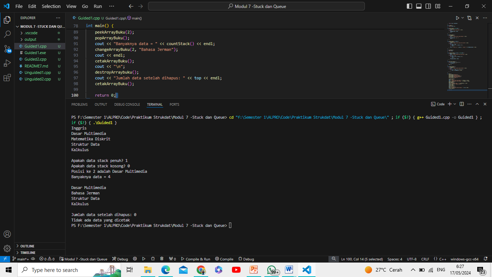
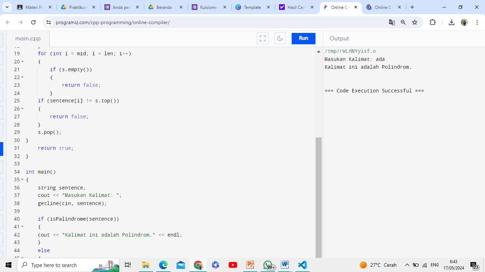
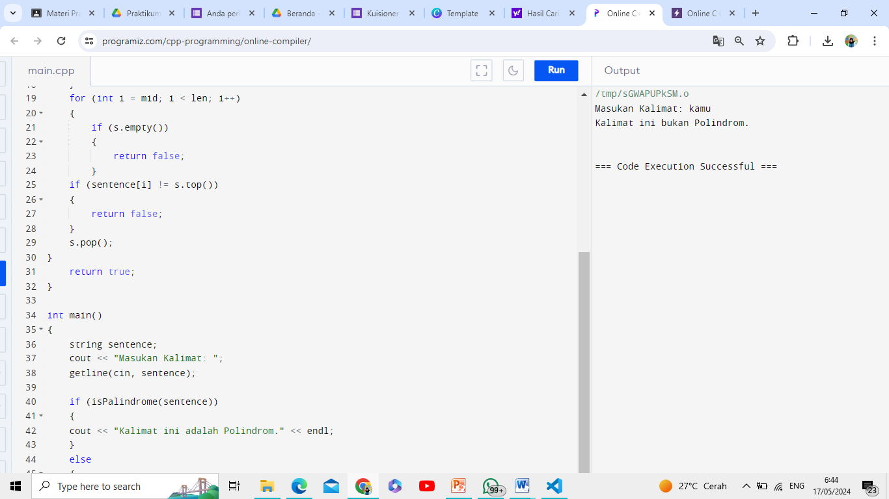

# <h1 align="center">Laporan Praktikum Modul Stuck dan Queue</h1>
<p align="center">Syalaisha Nisrina Anataya</p>

## Dasar Teori

### 1. STACK
Stack adalah jenis struktur data sederhana yang mirip seperti Linked Lists untuk menyimpan informasi. Stack / tumpukan berupa daftar terurut yang pengeluaran dan penghapusan dilakukan dari ujung yaitu data yang paling akhir dimasukkan. 

Operasi yang ada pada stack yaitu: 
a. Push (Masukkan): Menambahkan elemen ke dalam tumpukan pada posisi paling
atas atau ujung.
b. Pop (Keluarkan): Menghapus elemen dari posisi paling atas atau ujung tumpukan.
Praktikum Struktur Data dan Algoritma 1
c. Top (Atas): Mendapatkan nilai atau melihat elemen teratas pada tumpukan tanpa
menghapusnya.
d. IsEmpty (Kosong): Memeriksa apakah tumpukan kosong atau tidak.
e. IsFull (Penuh): Memeriksa apakah tumpukan penuh atau tidak (terutama pada
implementasi tumpukan dengan kapasitas terbatas).
f. Size (Ukuran): Mengembalikan jumlah elemen yang ada dalam tumpukan.
g. Peek (Lihat): Melihat nilai atau elemen pada posisi tertentu dalam tumpukan
tanpa menghapusnya.
h. Clear (Hapus Semua): Mengosongkan atau menghapus semua elemen dari
tumpukan.
i. Search (Cari): Mencari keberadaan elemen tertentu dalam tumpukan

### 2. QUEUE
Queue adalah truktur data untuk menyiman data dengan metode FIFO (First-In First-Out). Berarti data pertama yang dimasukkan akan menjadi data yang akan keluar pertama juga.

Operasi yang terdapat pada Queue : 
1. enqueue() : menambahkan data ke dalam queue.
2. dequeue() : mengeluarkan data dari queue.
3. peek() : mengambil data dari queue tanpa menghapusnya.
4. isEmpty() : mengecek apakah queue kosong atau tidak.
5. isFull() : mengecek apakah queue penuh atau tidak.
6. size() : menghitung jumlah elemen dalam queue.

## Guided 
### Guided 1
```C++
#include <iostream>
using namespace std;

string arrayBuku[5];
int maksimal = 5, top = 0;

bool isFull() {
    return (top == maksimal);
}

bool isEmpty() {
    return (top == 0);
}

void pushArrayBuku(string data) {
    if (isFull()) {
        cout << "Data telah penuh" << endl;
    } else {
        arrayBuku[top] = data;
        top++;
    }
}

void popArrayBuku() {
    if (isEmpty()) {
        cout << "Tidak ada data yang dihapus" << endl;
    } else {
        arrayBuku[top - 1] = "";
        top--;
    }
}

void peekArrayBuku(int posisi) {
    if (isEmpty()) {
        cout << "Tidak ada data yang bisa dilihat" << endl;
    } else {
        int index = top;
        for (int i = 1; i <= posisi; i++) {
            index--;
        }
        cout << "Posisi ke " << posisi << " adalah " << arrayBuku[index] << endl;
    }
}

int countStack() {
    return top;
}

void changeArrayBuku(int posisi, string data) {
    if (posisi > top) {
        cout << "Posisi melebihi data yang ada" << endl;
    } else {
        int index = top;
        for (int i = 1; i <= posisi; i++) {
            index--;
        }
        arrayBuku[index] = data;
    }
}

void destroyArraybuku() {
    for (int i = top; i >= 0; i--) {
        arrayBuku[i] = "";
    }
    top = 0;
}

void cetakArrayBuku() {
    if (isEmpty()) {
        cout << "Tidak ada data yang dicetak" << endl;
    } else {
        for (int i = top - 1; i >= 0; i--) {
            cout << arrayBuku[i] << endl;
        }
    }
}

int main() {
    pushArrayBuku("Kalkulus");
    pushArrayBuku("Struktur Data");
    pushArrayBuku("Matematika Diskrit");
    pushArrayBuku("Dasar Multimedia");
    pushArrayBuku("Inggris");

    cetakArrayBuku();
    cout << "\n";
    cout << "Apakah data stack penuh? " << isFull() << endl;
    cout << "Apakah data stack kosong? " << isEmpty() << endl;
    peekArrayBuku(2);
    popArrayBuku();
    cout << "Banyaknya data = " << countStack() << endl;
    changeArrayBuku(2, "Bahasa Jerman");
    cout << endl;
    cetakArrayBuku();
    cout << "\n";
    destroyArraybuku();
    cout << "Jumlah data setelah dihapus: " << top << endl;
    cetakArrayBuku();

    return 0;
}
```
Kode program tersebut adalah implementasi dari Stuck yng menggunakan array. Pertama tama program akan mendeklarasikan sebuah array string `arrayBuku` dengan ukuran 5, variabel `maksimal` yang menunjukkan kapasitas maksimum stack, dan variabel `top` yang menunjukkan posisi teratas dari stack. Kemudian ada beberapa fungsi yang digunakan dalam kode program yaitu : 
- fungsi `isFull()` akan mengembalikan `true` jika stack sudah penuh (yaitu, `top` = `maksimal`), dan `false` jika sebaliknya. 
- Fungsi `isEmpty()` akan mengembalikan `true` jika stack kosong (yaitu, `top` adalah 0), dan `false` jika sebaliknya. 
- fungsi `pushArrayBuku(string data)` untuk menambahkan elemen ke stack. Jika stack sudah penuh, maka akan mencetak "Data telah penuh". Jika tidak, maka data akan ditambahkan ke posisi `top` dari stack dan `top` akan diincrement.
- Fungsi `popArrayBuku()` untuk menghapus elemen dari stack. Jika stack kosong, maka akan mencetak "Tidak ada data yang dihapus". Jika tidak, maka data di posisi `top - 1` dari stack akan dihapus dan `top` akan didecrement.
- Fungsi `peekArrayBuku()` untuk melihat elemen pada posisi tertentu dalam stack. Jika stack kosong, maka akan mencetak "Tidak ada data yang bisa dilihat". Jika tidak, maka akan mencetak data pada posisi yang diminta.
- Fungsi `countStack()` untuk mengembalikan jumlah elemen dalam stack, yaitu nilai dari `top`.
- Fungsi `changeArrayBuku(int posisi, string data)`untuk mengubah data pada posisi tertentu dalam stack. Jika posisi yang diminta melebihi jumlah data yang ada, maka akan mencetak "Posisi melebihi data yang ada". Jika tidak, maka data pada posisi yang diminta akan diubah.
- Fungsi `destroyArraybuku()`untuk menghapus semua data dalam stack dan mengatur `top` menjadi 0.
- Fungsi `cetakArrayBuku()` untuk mencetak semua data dalam stack. Jika stack kosong, maka akan mencetak "Tidak ada data yang dicetak". Jika tidak, maka semua data dalam stack akan dicetak.

#### Output : 


### Guided 2
```C++
#include <iostream>
using namespace std;

const int maksimalQueue = 5; // Maksimal antrian
int front = 0; // Penanda depan antrian
int back = 0; // Penanda belakang antrian
string queueTeller[5]; // Array untuk menyimpan antrian

bool isFull() { // Pengecekan antrian penuh atau tidak
    if (back == maksimalQueue) {
        return true; // =1
    } else {
        return false;
    }
}

bool isEmpty() { // Antrian kosong atau tidak
    if (back == 0) {
        return true;
    } else {
        return false;
    }
}

void enqueueAntrian(string data) { // Menambahkan antrian
    if (isFull()) {
        cout << "Antrian penuh" << endl;
    } else {
        if (isEmpty()) { // Jika antrian kosong
            queueTeller[0] = data;
            front++;
            back++;
        } else { // Jika antrian ada isi
            queueTeller[back] = data;
            back++;
        }
    }
}

void dequeueAntrian() { // Mengurangi antrian
    if (isEmpty()) {
        cout << "Antrian kosong" << endl;
    } else {
        for (int i = 0; i < back; i++) {
            queueTeller[i] = queueTeller[i + 1];
        }
        back--;
    }
}

int countQueue() { // Menghitung jumlah antrian
    return back;
}

void clearQueue() { // Menghapus semua antrian
    if (isEmpty()) {
        cout << "Antrian kosong" << endl;
    } else {
        for (int i = 0; i < back; i++) {
            queueTeller[i] = "";
        }
        back = 0;
        front = 0;
    }
}

void viewQueue() { // Melihat isi antrian
    cout << "Data antrian teller:" << endl;
    for (int i = 0; i < maksimalQueue; i++) {
        if (queueTeller[i] != "") {
            cout << i + 1 << ". " << queueTeller[i] << endl;
        } else {
            cout << i + 1 << ". (kosong)" << endl;
        }
    }
}

int main() {
    enqueueAntrian("Andi");
    enqueueAntrian("Maya");
    viewQueue();
    cout << "Jumlah antrian = " << countQueue() << endl;
    dequeueAntrian();
    viewQueue();
    cout << "Jumlah antrian = " << countQueue() << endl;
    clearQueue();
    viewQueue();
    cout << "Jumlah antrian = " << countQueue() << endl;
    return 0;
}
```
Kode program diatas adalah implementasi dari Queue / Antrian. Pada `const int maksimalQueue = 5;` mendefinisikan konstanta untuk ukuran maksimal antrian yaitu 5 dengan `int front = 0;` dan `int back = 0;` sebagai penanda depan dan belakang antrian. Kemudian, ada `string queueTeller[5];`  untuk menyimpan data antrian dengan maksimal 5 data. Selain itu, juga terdapat fungsi fungsi yang mirip pada kode program Stuck yaitu `bool isFull()`dan `bool isEmpty()` untuk mengecek antrian penuh atau kosong. Tidak ketinggalan pula fungsi fungsi seperti`void enqueueAntrian(string data)`, `void dequeueAntrian()`, `int countQueue()` , `void clearQueue()`, dan `void viewQueue()` dengan fungsinya secara urut yaitu untuk menambahkan, menghapus, menghitung, dan melihat data dalam antrian.

#### Output : 


## Unguided 
### 1. Buatlah program untuk menentukan apakah kalimat tersebut yang diinputkan dalam program stack adalah palindrom/tidak. Palindrom kalimat yang dibaca dari depan dan belakang sama. Jelaskan bagaimana cara kerja programnya.

```C++
#include <iostream>
#include <stack>
#include <string>
using namespace std;
bool isPalindrome(string sentence)
{
    stack<char> s;
    int len = sentence.length();
    int mid = len / 2;

    for (int i = 0; i < mid; i++)
    {
        s.push(sentence[i]);
    }
    if (len % 2 != 0)
    {
        mid++;
    }
    for (int i = mid; i < len; i++)
    {
        if (s.empty())
        {
            return false;
        }
    if (sentence[i] != s.top())
    {
        return false;
    }
    s.pop();
}
    return true;
}

int main()
{
    string sentence;
    cout << "Masukan Kalimat: ";
    getline(cin, sentence);

    if (isPalindrome(sentence))
    {
    cout << "Kalimat ini adalah Polindrom." << endl;
    }
    else
    {
    cout << "Kalimat ini bukan Polindrom." << endl;
    }
    return 0;
}
```
Kode program trsebut akan mengecek apakah suatu kalimat/kata termasuk palindrom atau bukan. Pertama tama program akan meminta memasukkan kalimat atai kata dengan menggunakan `getline(cin, sentence);`. Kemudian fungsi `isPalindrome` akan dipanggil ketika kalimat yang dimasukkan oleh pengguna. Pada fungsi ini sebuah stack karakter dibuat dan panjang kalimat dihitung. Kemudian, untuk setiap karakter di sisa kalimat, program memeriksa apakah karakter tersebut sama dengan karakter ter.atas di stack. Jika tidak, fungsi segera mengembalikan `false`, yang berarti kalimat bukan palindrom.
#### Output : 


Dapat silihat pada output ketika diinputkan kata "ada", output akan "Kalimat ini adalah Polindrom." Sedangkan ketika diinputkan kata "kamu", outputnya adalah  "Kalimat ini bukan Polindrom."
### 2. Ubah guided queue diatas agar menjadi program inputan user dan program menu.

```C++
#include <iostream>
using namespace std;

const int maksimalQueue = 5; // Maksimal antrian
int front = 0; 
int back = 0; 
string queueTeller[5]; // Array untuk menyimpan antrian

bool isFull() { // Pengecekan antrian penuh atau tidak
    if (back == maksimalQueue) {
        return true;
    } else {
        return false;
    }
}

bool isEmpty() { // Antrian kosong atau tidak
    if (back == 0) {
        return true;
    } else {
        return false;
    }
}

void enqueueAntrian(string data) { // Menambahkan antrian
    if (isFull()) {
        cout << "Antrian penuh" << endl;
    } else {
        if (isEmpty()) { // Jika antrian kosong
            queueTeller[0] = data;
            front++;
            back++;
        } else { // Jika antrian ada isi
            queueTeller[back] = data;
            back++;
        }
    }
}

void dequeueAntrian(int index) { // Mengurangi antrian
    if (isEmpty()) {
        cout << "Antrian kosong" << endl;
    } else {
        for (int i = index; i < back; i++) {
            queueTeller[i] = queueTeller[i + 1];
        }
        back--;
    }
}

int countQueue() { // Menghitung jumlah antrian
    return back;
}

void clearQueue() { // Menghapus semua antrian
    if (isEmpty()) {
        cout << "Antrian kosong" << endl;
    } else {
        for (int i = 0; i < back; i++) {
            queueTeller[i] = "";
        }
        back = 0;
        front = 0;
    }
}

void viewQueue() { // Melihat isi antrian
    cout << "Data antrian teller:" << endl;
    for (int i = 0; i < maksimalQueue; i++) {
        if (queueTeller[i] != "") {
            cout << i + 1 << ". " << queueTeller[i] << endl;
        } else {
            cout << i + 1 << ". (kosong)" << endl;
        }
    }
}

int main() {
    int pilihan;
    string data;
    do {
        cout << "Menu:\n1. Tambah Antrian\n2. Kurangi Antrian\n3. Lihat Antrian\n4. Hapus Semua Antrian\n5. Keluar\nPilih: ";
        cin >> pilihan;
        switch (pilihan) {
            case 1:
                cout << "Masukkan nama: ";
                cin >> data;
                enqueueAntrian(data);
                break;
            case 2:
                int index;
                cout << "Masukkan nomor antrian yang ingin dikurangi: ";
                cin >> index;
                dequeueAntrian(index - 1);
                break;
            case 3:
                viewQueue();
                cout << "Jumlah antrian = " << countQueue() << endl;
                break;
            case 4:
                clearQueue();
                break;
            case 5:
                cout << "Terima kasih telah menggunakan program ini.\n";
                break;
            default:
                cout << "Pilihan tidak valid.\n";
                break;
        }
    } while (pilihan != 5);
    return 0;
}
```
Kode program diatas adalah implementasi dari Queue dengan memasukkan pilihan menu. Program mendefinisikan beberapa variabel global yang digunakan yaitu `maksimalQueue` yang menentukan kapasitas maksimal antrian, `front` dan `back` yang menunjukkan indeks depan dan belakang, serta `queueTeller` sebagai array untuk menyimpan data antrian. Kemudian terdapat juga beberapa fugsi yang digunakan yaitu fungsi `isFull()`dan `isEmpty()`untuk mengecek antrian penuh atau kosong, Fungsi `enqueueAntrian(string data)` dan  `dequeueAntrian(int index)`unruk menambahkan dan mengurangi anrian, fungsi `countQueue()` untuk menghitung jumlah anrian,  `clearQueue()` untuk membersihkan semua antrian, dan `viewQueue()`unuk melihat isi antrian.

#### Output : 
.png)
Ditambahkan antrian sebanyak 3 kali dengan nama yang berbeda.
.png)
Menampilkan semua antrian dan menghapus antrian
.png)
Menjumlahkan jumlah antrian yang ada.


## Kesimpulan 
Dari Modul 7 tentang Stuck dan Queue ini, dapat diambil beberapa kesimpulan yaitu:
1. Stuck adalah koleksi terurut dengan operasi di satu ujung sehingga bersifat Last In Firs Out (LIFO) dengan operasi utama yaitu push, pop, top, isEmpty, isFull, size, Peek, clear, dan Search.

2. Queue adalah koleksi terurut menggunakan metode FIFO(First-In First-Out) dengan operasi utama yaitu enqueue, dequeue, peek, is Empty, isFull, size.

## Referensi
1. Karumanchi, N. (2016). Data Structures and algorithms made easy: Concepts,problems, Interview Questions. CareerMonk Publications.

2. BENHUR, R. (2012). INTERPRETASI PENAMPANG POST-STACK DEPTH MIGRATION (PSDM) LAPANGAN “SMLK-16” CEKUNGAN GORONTALO (Doctoral dissertation, UPN" Veteran" Yogyakarta).

3. Zusane Oematan, M. (2010). Stack Dan Pengenalan Procedure.

4. Nurhayati, S. (2013). Queue.