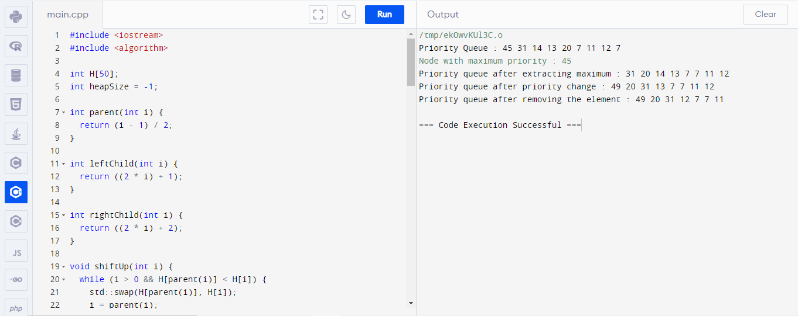
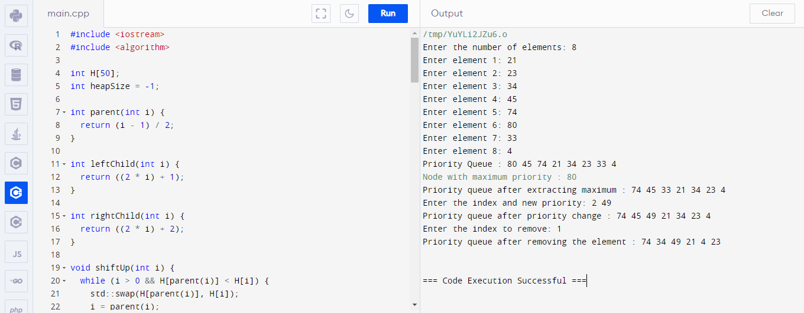

# <h1 align="center">Laporan Praktikum Modul PRIORITY QUEUE DAN HEAPS
</h1>
<p align="center">Syalaisha Nisrina Anataya</p>

## Dasar Teori

### 1. Priority Queue
Priority Queue adakah struktur data yang menyimpan kumpulan elemen, masing-masing terkait dengan prioritas.
- Pengurutan: Elemen-elemen dalam antrean prioritas diurutkan berdasarkan nilai prioritasnya. Elemen dengan prioritas tertinggi biasanya diambil terlebih dahulu.

- Operasi: Antrian prioritas mendukung berbagai operasi seperti Insert, FindMin, Delete, dan ExtractMin, yang memungkinkan manipulasi elemen secara efisien berdasarkan prioritasnya.

### 2. Heaps
Heaps adalah struktur data berbasis pohon khusus yang memenuhi properti tumpukan. Properti heap mendefinisikan hubungan antara simpul induk dan simpul anak dalam heap. 

Ada dua jenis utama heap:
1. Min-Heap: Dalam sebuah min-heap, untuk setiap node 'i' selain root, nilai node tersebut lebih besar atau sama dengan nilai node induknya. Ini berarti bahwa simpul akar berisi nilai minimum dalam timbunan.

2. Max-Heap: Dalam sebuah max-heap, untuk setiap simpul 'i' selain root, nilai simpul tersebut kurang dari atau sama dengan nilai simpul induknya. Hal ini mengakibatkan simpul akar berisi nilai maksimum dalam heap.

Heap biasanya diimplementasikan sebagai pohon biner lengkap, di mana semua level pohon terisi penuh kecuali mungkin level terakhir, yang diisi dari kiri ke kanan.

## Guided 
### Guided 1
```C++
#include <iostream>
#include <algorithm>

int H[50];
int heapSize = -1;

int parent(int i) {
  return (i - 1) / 2;
}

int leftChild(int i) {
  return ((2 * i) + 1);
}

int rightChild(int i) {
  return ((2 * i) + 2);
}

void shiftUp(int i) {
  while (i > 0 && H[parent(i)] < H[i]) {
    std::swap(H[parent(i)], H[i]);
    i = parent(i);
  }
}

void shiftDown(int i) {
  int maxIndex = i;
  int l = leftChild(i);
  if (l <= heapSize && H[l] > H[maxIndex]) {
    maxIndex = l;
  }

  int r = rightChild(i);
  if (r <= heapSize && H[r] > H[maxIndex]) {
    maxIndex = r;
  }

  if (i != maxIndex) {
    std::swap(H[i], H[maxIndex]);
    shiftDown(maxIndex);
  }
}

void insert(int p) {
  heapSize = heapSize + 1;
  H[heapSize] = p;
  shiftUp(heapSize);
}

int extractMax() {
  int result = H[0];
  H[0] = H[heapSize];
  heapSize = heapSize - 1;
  shiftDown(0);
  return result;
}

void changePriority(int i, int p) {
  int oldp = H[i];
  H[i] = p;
  if (p > oldp) {
    shiftUp(i);
  } else {
    shiftDown(i);
  }
}

int getMax() {
  return H[0];
}

void remove(int i) {
  H[i] = getMax() + 1;
  shiftUp(i);
  extractMax();
}

int main() {
  insert(45);
  insert(20);
  insert(14);
  insert(12);
  insert(31);
  insert(7);
  insert(11);
  insert(13);
  insert(7);

  std::cout << "Priority Queue : ";
  for (int i = 0; i <= heapSize; ++i) {
    std::cout << H[i] << " ";
  }
  std::cout << "\n";

  std::cout << "Node with maximum priority : " << extractMax() << "\n";

  std::cout << "Priority queue after extracting maximum : ";
  for (int i = 0; i <= heapSize; ++i) {
    std::cout << H[i] << " ";
  }
  std::cout << "\n";

  changePriority(2, 49);

  std::cout << "Priority queue after priority change : ";
  for (int i = 0; i <= heapSize; ++i) {
    std::cout << H[i] << " ";
  }
  std::cout << "\n";

  remove(3);
  std::cout << "Priority queue after removing the element : ";
  for (int i = 0; i <= heapSize; ++i) {
    std::cout << H[i] << " ";
  }
    return 0;
}
```
Kode program diatas mengimplementasikan Priority Queue menggunakan Heap yaitu Max Heap. Pada awal programdideklrasikan bahwa elemen elemen heap akan disimpn dalam array bernama H dengan maksimal data sebanyak 50. Kemudian pada  `heapSize` diinisialisasikan dengan -1 yang artinya heap masih kosong. Selanjutnya terdapat beberapa fungsi yaitu :
- `parent(i)` untuk mengembalikan indeks orang tua dari elemen dengan indeks `i` 
- `leftChild(i)`dan `rightChild(i)` untuk mengembalikan indeks anak kiri dan kanan dari elemen dengan indeks `i`.

Selain itu, terdapat juga beberapa operasi pada heap yaitu :
- `shiftUp(i)` untuk memastikan bahwa setelah menambahkan elemen baru ke dalam heap, elemen dengan prioritas lebih tinggi(nilai lebih besar) berada di atas. Fungsi ini akan membandingkan elemen baru dengan parrent dan menukar posisi jika diperlukan.
- `shiftDown(i)` untuk memastikan bahwa setelah menghapus elemen dari heap, prioritas pada heap tetap terpenuhi. Fungsi ini akan membandingkan elemen dengan anak-anaknya dan menukar posisi jika diperlukan hingga properti heap terpenuhi.
- `insert(p)` yaitu menyisipkan elemen dengan prioritas `p` ke dalam heap dan memanggil `shiftUp` untuk memastikan properti heap terpenuhi.
- `extractMax()`untuk menghapus elemen dengan prioritas tertinggi (akar heap) dan mengembalikan nilainya. Setelah menghapus, fungsi ini memanggil `shiftDown` untuk memastikan properti heap tetap terpenuhi.
- `changePriority(i, p)`untuk mengubah prioritas elemen dengan indeks `i` menjadi `p`. Fungsi ini membandingkan prioritas baru dengan prioritas lama dan memanggil `shiftUp` atau `shiftDown`.
- `getMax()`untuk mengembalikan nilai elemen dengan prioritas tertinggi tanpa menghapusnya.
- `remove(i)`untuk menghapus elemen dengan indeks `i` dengan cara menggantikan nilainya dengan prioritas yang lebih tinggi daripada semua elemen lain. Kemudian, fungsi ini memanggil `shiftUp` untuk memastikan properti heap terpenuh

Selanjutnya pada operasi main() terdapat fungsi insert yang menginsertkan beberapa elemen ke dalam heap dan menampilkannya. Dilanjutkan dengan perintah  mengambil element dengan prioritas tertinggi dan menghapusnya dengan extractMax. Dilanjutkan perintah mengubah prioritas elemen ke-2 menjadi 49 menggunakan changePriority. Terakhir, kita menghapus elemen dengan indeks 3 menggunakan remove.

#### Output : 


## Unguided 
### 1.  Modifikasi guided diatas yang mana heap dikonstruksi secara manual berdasarkan user.

```C++
#include <iostream>
#include <algorithm>

int H[50];
int heapSize = -1;

int parent(int i) {
  return (i - 1) / 2;
}

int leftChild(int i) {
  return ((2 * i) + 1);
}

int rightChild(int i) {
  return ((2 * i) + 2);
}

void shiftUp(int i) {
  while (i > 0 && H[parent(i)] < H[i]) {
    std::swap(H[parent(i)], H[i]);
    i = parent(i);
  }
}

void shiftDown(int i) {
  int maxIndex = i;
  int l = leftChild(i);
  if (l <= heapSize && H[l] > H[maxIndex]) {
    maxIndex = l;
  }

  int r = rightChild(i);
  if (r <= heapSize && H[r] > H[maxIndex]) {
    maxIndex = r;
  }

  if (i != maxIndex) {
    std::swap(H[i], H[maxIndex]);
    shiftDown(maxIndex);
  }
}

void insert(int p) {
  heapSize = heapSize + 1;
  H[heapSize] = p;
  shiftUp(heapSize);
}

int extractMax() {
  int result = H[0];
  H[0] = H[heapSize];
  heapSize = heapSize - 1;
  shiftDown(0);
  return result;
}

void changePriority(int i, int p) {
  int oldp = H[i];
  H[i] = p;
  if (p > oldp) {
    shiftUp(i);
  } else {
    shiftDown(i);
  }
}

int getMax() {
  return H[0];
}

void remove(int i) {
  H[i] = getMax() + 1;
  shiftUp(i);
  extractMax();
}

int main() {
  int n;
  std::cout << "Enter the number of elements: ";
  std::cin >> n;

  for (int i = 0; i < n; ++i) {
    int p;
    std::cout << "Enter element " << i + 1 << ": ";
    std::cin >> p;
    insert(p);
  }

  std::cout << "Priority Queue : ";
  for (int i = 0; i <= heapSize; ++i) {
    std::cout << H[i] << " ";
  }
  std::cout << "\n";

  std::cout << "Node with maximum priority : " << extractMax() << "\n";

  std::cout << "Priority queue after extracting maximum : ";
  for (int i = 0; i <= heapSize; ++i) {
    std::cout << H[i] << " ";
  }
  std::cout << "\n";

  int index, p;
  std::cout << "Enter the index and new priority: ";
  std::cin >> index >> p;
  changePriority(index, p);

  std::cout << "Priority queue after priority change : ";
  for (int i = 0; i <= heapSize; ++i) {
    std::cout << H[i] << " ";
  }
  std::cout << "\n";

  int removeIndex;
  std::cout << "Enter the index to remove: ";
  std::cin >> removeIndex;
  remove(removeIndex);

  std::cout << "Priority queue after removing the element : ";
  for (int i = 0; i <= heapSize; ++i) {
    std::cout << H[i] << " ";
  }
  std::cout << "\n";

  return 0;
}
```
Kode program tersebut sama dengan kode program pada Guided 1 implementasikan Priority Queue menggunakan Heap yaitu Max Heap, tetapi dengan input elemen dilakukan oleh user.
#### Output : 

Dapat terlihat pada output bahwa user memasukkan jumlah elemen yang dapat diinputkan yaitu 8 dan menginputkan element. Kemudian menampilkan priority queue yaitu 21, 23, 34, 45, 74, 80, 33, 4 dengan maximum priority yaitu 80. Kemudian setelah maksimum priority dihapus menampilkan Priority queue after extracting maximum yaitu 74 45 33 21 34 23 4. Selanjutnya diminta memasukkan indext dan new priority (2, 49) dan menampilkan Priority queue after priority change yaitu 74 45 49 21 34 23 4 . Kemudian untuk menghapus pada index tertentu  diinputkan angnka 1 sehingga menampilkan Priority queue after removing the element : 74 34 49 21 4 23.

## Kesimpulan 
Dari Modul 8 tentang Priority Queue ini, dapat diambil beberapa kesimpulan yaitu:
1. Priority Queue adalah jenis queue yang mengatur elemen berdasarkan nilai prioritas, di mana elemen dengan nilai prioritas lebih tinggi akan diambil terlebih dahulu.

2. Heaps adalah struktur data berbasis pohon biner dengan aturan tertentu, seperti complete binary tree dan order property (max-heap dan min-heap).

3. Implementasi priority queue dan heaps dapat dilakukan dengan menggunakan array dan operasi-operasi seperti shiftUp, shiftDown, insert, extractMax, changePriority, dan remove.

4. Priority queue sering digunakan dalam sistem real-time dan algoritma untuk meningkatkan efisiensi, seperti dalam algoritma Dijkstra dan pencarian A*.
Kelebihan heap terletak pada kecepatan operasi, di mana menambah atau menghapus elemen dalam heap membutuhkan waktu O(log N) dan mencari elemen minimum/maksimum membutuhkan waktu konstan O(1).

## Referensi
1. "A Survey of Priority Queues and Heaps" oleh Michael Goodrich, Roberto Tamassia, and Michael H. Goldwasser (https://www.sciencedirect.com/journal/journal-of-algorithms)

2. E. Shi, "Path Oblivious Heap: Optimal and Practical Oblivious Priority Queue," 2020 IEEE Symposium on Security and Privacy (SP), San Francisco, CA, USA, 2020, pp. 842-858, doi: 10.1109/SP40000.2020.00037. keywords: {Bandwidth;Sorting;Random access memory;Security;Binary trees;Outsourcing},

