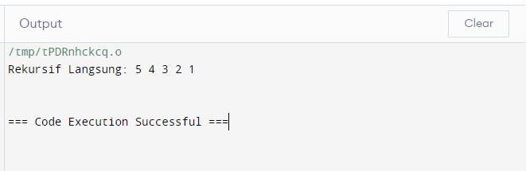
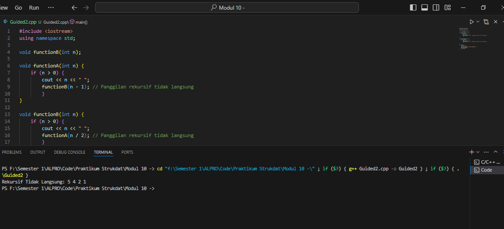
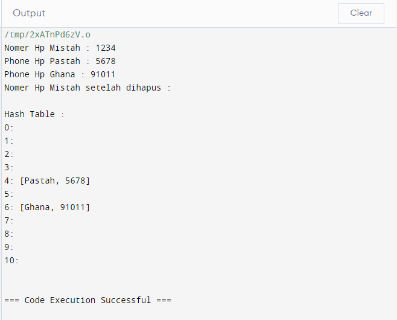
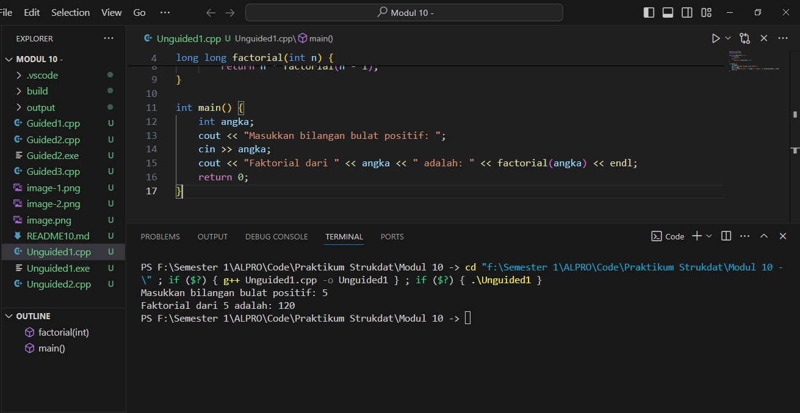
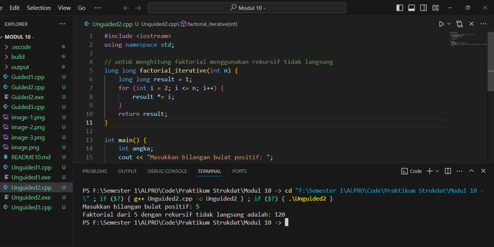
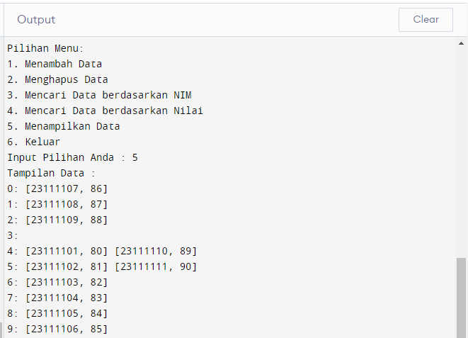
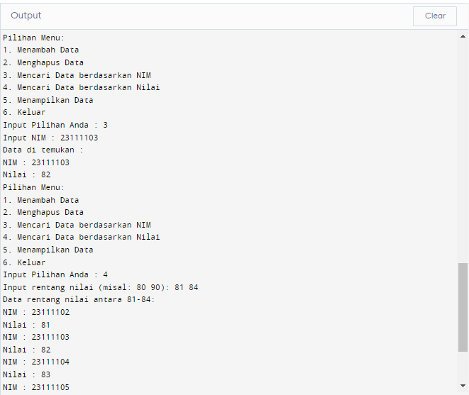

# <h1 align="center">Laporan Praktikum Modul Rekursif dan Hash
</h1>
<p align="center">Syalaisha Nisrina Anataya</p>

## Dasar Teori

### A. REKURSIF
Rekursif, atau dalam bahasa Inggris dikenal sebagai "recursion", adalah sebuah teknik penyelesaian masalah yang melibatkan pemanggilan fungsi itu sendiri secara berulang. Pemanggilan ini dilakukan hingga mencapai kondisi dasar (base case) yang tidak memerlukan pemanggilan rekursif lagi.

Rekursif sering digunakan dalam pemrograman untuk menyelesaikan masalah yang bersifat struktural atau berulang. 
## Jenis jenis Rekursif
Menurut [Singh & Kumar, 2020] dan [Marques et al., 2021], terdapat beberapa jenis rekursif berdasarkan strukturnya, yaitu:

1. Rekursif Langsung (Direct Recursion): Pada rekursif langsung, fungsi memanggil dirinya sendiri secara langsung dalam pernyataan definisinya. Jenis ini dapat dibagi lagi menjadi:

- Rekursif Ekor (Tail Recursion): Pada rekursif ekor, pemanggilan rekursif terjadi pada akhir fungsi, sehingga tidak memerlukan ruang memori tambahan untuk menyimpan konteks pemanggilan sebelumnya.
- Rekursif Kepala (Head Recursion): Pada rekursif kepala, pemanggilan rekursif terjadi pada awal fungsi, sehingga memerlukan ruang memori yang lebih besar untuk menyimpan konteks pemanggilan sebelumnya.
Rekursif Bersarang (Nested Recursion): Pada rekursif bersarang, terdapat lebih dari satu pemanggilan rekursif dalam satu fungsi.
2. Rekursif Tidak Langsung (Indirect Recursion): Pada rekursif tidak langsung, fungsi tidak memanggil dirinya sendiri secara langsung, melainkan memanggil fungsi lain yang pada akhirnya akan memanggil fungsi awal.

3. Rekursif Primitif (Primitive Recursion): Pada rekursif primitif, fungsi hanya memanggil dirinya sendiri dengan argumen yang lebih sederhana.

4. Rekursif Mutual (Mutual Recursion): Pada rekursif mutual, dua atau lebih fungsi saling memanggil satu sama lain.

### B. HASH TABLE
Tabel Hash adalah struktur data yang menyimpan data dalam bentuk pasangan kunci-nilai (key-value). Kunci adalah pengenal unik untuk setiap nilai, dan nilai adalah data yang ingin disimpan. Tabel hash menggunakan fungsi hash untuk memetakan kunci ke indeks dalam array, yang disebut bucket. Nilai kemudian disimpan di bucket yang sesuai.

## Guided 
### Guided 1 : Rekursif Langsung (Direct Recursion)
```C++
#include <iostream>
using namespace std;

// Fungsi ini berfungsi untuk melakukan hitung mundur
// dari angka yang diinputkan
void countdown(int n) {
    if (n == 0) {
        return;
    }
    cout << n << " ";
    countdown(n - 1);
}

int main() {
    cout << "Rekursif Langsung: ";
    countdown(5); // 5 merupakan input nya
    cout << endl;
    return 0;
}
```

#### Output : 


### Guided 2 : Rekursif Tidak Langsung (Indirect Recursion)
```C++
#include <iostream>
using namespace std;

void functionB(int n);

void functionA(int n) {
    if (n > 0) {
        cout << n << " ";
        functionB(n - 1); // Panggilan rekursif tidak langsung
        }
}

void functionB(int n) {
    if (n > 0) {
        cout << n << " ";
        functionA(n / 2); // Panggilan rekursif tidak langsung
        }
}

int main() {
    int num = 5;
    cout << "Rekursif Tidak Langsung: ";
    functionA(num);
    return 0;
}
```
Kode program tersebut adalah contoh dari rekursif tidak langsung. Kode berjalan dimulai dengan fungsi `main()`. Di dalam fungsi ini, variabel `num` diinisialisasi dengan nilai 5. Kemudian, fungsi `functionA(num)` dipanggil dengan `num` sebagai argumen.  Kemudian pada fungsi `functionA(int n)`, jika `n` lebih besar dari 0, program akan mencetak nilai `n` dan memanggil fungsi `functionB(n - 1)`. Jadi, fungsi `functionA()` memanggil fungsi `functionB()` secara rekursif dengan argumen `n - 1`. Sedangkan pada fungsi `functionB(int n)`, jika `n` lebih besar dari 0, program akan mencetak nilai `n` dan memanggil fungsi `functionA(n / 2)`. Jadi, fungsi `functionB()` memanggil fungsi `functionA()` secara rekursif dengan argumen `n / 2`. Proses ini akan terus berlanjut sampai nilai `n` menjadi 0. Output yang akan dihasilkan adalah urutan angka yang dicetak oleh fungsi `functionA()` dan `functionB()` selama proses rekursi. Urutan ini akan bergantung pada nilai awal `num` yang diberikan dalam fungsi `main()`. Karena pada program `num`nya adalah 5, sehingga nilai awal yang tercetak adalah 5.

#### Output : 



### Guided 3
```C++
#include <iostream>
#include <string>
#include <vector>

using namespace std;

const int TABLE_SIZE = 11;

class HashNode {
public:
    string name;
    string phone_number;

    HashNode(string name, string phone_number) {
        this->name = name;
        this->phone_number = phone_number;
    }
};

class HashMap {
private:
    vector<HashNode*> table[TABLE_SIZE];

public:
    int hashFunc(string key) {
        int hash_val = 0;
        for (char c : key) {
            hash_val += c;
        }
        return hash_val % TABLE_SIZE;
    }

    void insert(string name, string phone_number) {
        int hash_val = hashFunc(name);
        for (auto node : table[hash_val]) {
            if (node->name == name) {
                node->phone_number = phone_number;
                return;
            }
        }
        table[hash_val].push_back(new HashNode(name, phone_number));
    }

    void remove(string name) {
        int hash_val = hashFunc(name);
        for (auto it = table[hash_val].begin(); it != table[hash_val].end(); it++) {
            if ((*it)->name == name) {
                table[hash_val].erase(it);
                return;
            }
        }
    }

    string searchByName(string name) {
        int hash_val = hashFunc(name);
        for (auto node : table[hash_val]) {
            if (node->name == name) {
                return node->phone_number;
            }
        }
        return "";
    }

    void print() {
        for (int i = 0; i < TABLE_SIZE; i++) {
            cout << i << ": ";
            for (auto pair : table[i]) {
                if(pair != nullptr){
                    cout << "[" << pair->name << ", " << pair->phone_number << "]";
                }
            }
            cout << endl;
        }
    }
};

int main() {
    HashMap employee_map;
    employee_map.insert("Mistah", "1234");
    employee_map.insert("Pastah", "5678");
    employee_map.insert("Ghana", "91011");

    cout << "Nomer Hp Mistah : " << employee_map.searchByName("Mistah") << endl;
    cout << "Phone Hp Pastah : " << employee_map.searchByName("Pastah") << endl;
    cout << "Phone Hp Ghana : " << employee_map.searchByName("Ghana") << endl;

    employee_map.remove("Mistah");
    cout << "Nomer Hp Mistah setelah dihapus : " << employee_map.searchByName("Mistah") << endl << endl;

    cout << "Hash Table : " << endl;
    employee_map.print();

    return 0;
}
```
Kode program diatas adalah contoh dari implementasi hash table. Program diawali dengan definisi kelas `HashNode` dan `HashMap`. `HashNode` adalah kelas yang menyimpan pasangan nama dan nomor telepon. `HashMap` adalah kelas yang menyimpan array dari `HashNode`. Kemudian terdapat beberapa fungsi yang digunakan yaitu : 
- Fungsi `hashFunc(string key)` dalam kelas `HashMap`  untuk menghitung nilai hash dari kunci (dalam hal ini, nama). Nilai hash dihitung dengan menjumlahkan nilai ASCII dari setiap karakter dalam kunci, lalu modulo dengan `TABLE_SIZE`.
- Fungsi `insert(string name, string phone_number)`  untuk memasukkan pasangan nama dan nomor telepon ke dalam hash table. Jika nama sudah ada dalam tabel, maka nomor telepon akan diperbarui. Jika tidak, maka pasangan baru akan ditambahkan.
- Fungsi `remove(string name)` digunakan untuk menghapus pasangan nama dan nomor telepon dari hash table berdasarkan nama.
- Fungsi `searchByName(string name)` digunakan untuk mencari nomor telepon berdasarkan nama. Jika nama tidak ditemukan, fungsi ini akan mengembalikan string kosong.

#### Output :


## Unguided 
### 1.  Buatlah sebuah program Rekursif Langsung (Direct Recursion) yang menghitung nilai faktorial dari sebuah inputan bilangan bulat positif! 
Contoh Output:
Masukkan bilangan bulat positif: 5
Faktorial dari 5 adalah: 120

```C++
#include <iostream>
using namespace std;

long long factorial(int n) {
    if (n == 0)
        return 1;
    else
        return n * factorial(n - 1);
}

int main() {
    int angka;
    cout << "Masukkan bilangan bulat positif: ";
    cin >> angka;
    cout << "Faktorial dari " << angka << " adalah: " << factorial(angka) << endl;
    return 0;
}
```
Kode program diatas adalah cotoh faktorial dngan rekursif. Pada fungsi  `factorial(int n)` yang merupakan fungsi rekursif  menghitung faktorial dari suatu bilangan. Faktorial dari suatu bilangan adalah hasil perkalian bilangan tersebut dengan semua bilangan bulat positif yang lebih kecil daripada bilangan tersebut. Misalnya, faktorial dari 5 adalah 5 * 4 * 3 * 2 * 1 = 120.  Pada fungsi ini ketika `n` sama dengan 0, maka fungsi akan mengembalikan 1 karena faktorial dari 0 adalah 1. Jika `n` lebih besar dari 0, maka fungsi akan mengembalikan hasil perkalian `n` dengan `factorial(n - 1)`.Hal ini karena fungsi memanggil dirinya sendiri dengan argumen `n - 1`.  Proses ini berlanjut sampai `n` menjadi 0, pada titik mana panggilan rekursif berhenti dan fungsi mengembalikan hasil faktorial. Nilai n yang dimaksud 
adalah nilai inputtan dari pngguna pada fungsi `main()`.
#### Output : 


### 2. Buatlah versi program Rekursif Tidak Langsung (Indirect Recursion) dari soal nomor 1 di atas
```C++
#include <iostream>
using namespace std;

// untuk menghitung faktorial menggunakan rekursif tidak langsung
long long factorial_iterative(int n) {
    long long result = 1;
    for (int i = 2; i <= n; i++) {
        result *= i;
    }
    return result;
}

int main() {
    int angka;
    cout << "Masukkan bilangan bulat positif: ";
    cin >> angka;
    cout << "Faktorial dari " << angka << " dengan rekursif tidak langsung adalah: " << factorial_iterative(angka) << endl;
    return 0;
}
```
Program ini sama seperti program pada Unguided1 yaitu mencari faktorial. Yang membedakan adalah kode ini menggunakan rekursif tidak langsung, yang dapat terlihat dari penggunaan  loop iteratif untuk menghitung faktorial. Fungsi `factorial_iterative(int n)` mengalikan semua bilangan bulat dari 2 hingga `n` untuk mendapatkan hasil faktorial. Teknik ini lebih mudah dipahami dan lebih efisien dalam hal penggunaan memori dibandingkan dengan rekursi, terutama untuk nilai `n` yang sangat besar.
#### Output : 


### 3. Implementasikan hash table untuk menyimpan data mahasiswa. Setiap mahasiswa memiliki NIM dan nilai. Implementasikan fungsi untuk menambahkan data baru, menghapus data, mencari data berdasarkan NIM, dan mencari data berdasarkan nilai. Dengan ketentuan : a. Setiap mahasiswa memiliki NIM dan nilai. b. Program memiliki tampilan pilihan menu berisi poin C. c. Implementasikan fungsi untuk menambahkan data baru, menghapus data, mencari data berdasarkan NIM, dan mencari data berdasarkan rentang nilai (80 – 90).
```C++
#include <iostream>
#include <string>
#include <vector>

using namespace std;

const int TABLE_SIZE = 10;

class HashNode {
public:
    string NIM;
    int nilai;

    HashNode(string NIM, int nilai) {
        this->NIM = NIM;
        this->nilai = nilai;
    }
};

class HashMap {
private:
    vector<HashNode *> table[TABLE_SIZE];

public:
    int hashFunc(string key) {
        int hash_val = 0;
        for (char c : key) {
            hash_val += c;
        }
        return hash_val % TABLE_SIZE;
    }

    void insert(string NIM, int nilai) {
        int hash_val = hashFunc(NIM);
        for (auto node : table[hash_val]) {
            if (node->NIM == NIM) {
                node->nilai = nilai;
                return;
            }
        }
        table[hash_val].push_back(new HashNode(NIM, nilai));
        cout << "Data berhasil ditambahkan!" << endl;
    }

    void remove(string NIM) {
        int hash_val = hashFunc(NIM);
        for (auto it = table[hash_val].begin(); it != table[hash_val].end(); it++) {
            if ((*it)->NIM == NIM) {
                table[hash_val].erase(it);
                cout << "Data berhasil dihapus!\n";
                return;
            }
        }
    }

    string searchByNim() {
        string NIM;
        cout << "Input NIM : ";
        cin >> NIM;
        int hash_val = hashFunc(NIM);
        for (auto &node : table[hash_val]) {
            if (node->NIM == NIM) {
                string nilai = to_string(node->nilai);
                cout << "Data di temukan : \n"
                     << "NIM : " << NIM << endl
                     << "Nilai : " << nilai << endl;
                return nilai;
            }
        }
        cout << "Data anda dengan NIM " << NIM << " tidak ditemukan." << endl;
        return "";
    }

    void searchByrangeNim() {
        int lower, upper;
        cout << "Input rentang nilai (misal: 80 90): ";
        cin >> lower >> upper;
        cout << "Data rentang nilai antara " << lower << "-" << upper << ":\n";
        for (int i = 0; i < TABLE_SIZE; i++) {
            for (auto node : table[i]) {
                int nilai = node->nilai;
                if (nilai >= lower && nilai <= upper) {
                    cout << "NIM : " << node->NIM << endl
                         << "Nilai : " << node->nilai << endl;
                }
            }
        }
    }

    void print() {
        cout << "Tampilan Data :" << endl;
        for (int i = 0; i < TABLE_SIZE; i++) {
            cout << i << ": ";
            for (auto pair : table[i]) {
                if (pair != nullptr) {
                    cout << "[" << pair->NIM << ", " << pair->nilai << "] ";
                }
            }
            cout << endl;
        }
    }
};

int main() {
    HashMap employee_map;

    while (true) {
        cout << "Pilihan Menu: \n";
        cout << "1. Menambah Data\n";
        cout << "2. Menghapus Data\n";
        cout << "3. Mencari Data berdasarkan NIM\n";
        cout << "4. Mencari Data berdasarkan Nilai\n";
        cout << "5. Menampilkan Data\n";
        cout << "6. Keluar\n";
        cout << "Input Pilihan Anda : ";

        int pilih, nilai;
        string nim;
        cin >> pilih;

        switch (pilih) {
        case 1: {
            int x;
            cout << "Jumlah yang ingin ditambahkan : ";
            cin >> x;
            for (int i = 1; i <= x; i++) {
                cout << "Menambah data ke-" << i << endl;
                cout << "Input NIM : ";
                cin >> nim;
                cout << "Input Nilai : ";
                cin >> nilai;
                employee_map.insert(nim, nilai);
            }
            break;
        }
        case 2:
            cout << "Menghapus data\n";
            cout << "Input NIM : ";
            cin >> nim;
            employee_map.remove(nim);
            break;
        case 3:
            employee_map.searchByNim();
            break;
        case 4:
            employee_map.searchByrangeNim();
            break;
        case 5:
            employee_map.print();
            break;
        case 6:
            cout << "Keluar\n";
            return 0;
        default:
            break;
        }
    }

    return 0;
}
```
Kode program tersebut adalah implementasi dari  Hash Table dengan Separate Chaining. Kode program ini mendefinisikan  `HashNode` untuk menyimpan pasangan kunci-nilai. `NIM` bertindak sebagai kunci dan `nilai`. sedangkan  `HashMap` merupakan array dari `vector<HashNode *>` dengan ukuran `TABLE_SIZE`. Kemudian `hashFunc` untuk menghitung nilai hash dari kunci. Nilai hash dihitung dengan menjumlahkan nilai ASCII dari setiap karakter dalam kunci dan kemudian mengambil modulus dengan `TABLE_SIZE`. `searchByNim`untuk mencari nilai berdasarkan kunci. Pertama, ia meminta pengguna untuk memasukkan kunci. Kemudian, ia menghitung nilai hash dari kunci dan mencari kunci dalam vektor yang sesuai. Jika kunci ditemukan, nilai ditampilkan. Begiu juga dengan `searchByrangeNim`, tetapi ia meminta inputtan dlam bentuk rentang.

#### Output : 
 


## Kesimpulan 
Dari Modul 9 tentang Rekursif dan Hash ini, dapat diambil beberapa kesimpulan yaitu:
1. Memahami konsep rekursif yaitu sebagai proses di mana fungsi memanggil dirinya sendiri, dengan penekanan pada kondisi yang mengakhiri proses tersebut.

2. Jenis rekursif yaitu ekursi langsung, di mana fungsi memanggil dirinya sendiri, dan rekursi tidak langsung, melalui fungsi lain.

3. Rekursif lebih mudah dimengerti dan efektif untuk tugas-tugas tertentu, namun memiliki masalah efisiensi ruang dan waktu.

4. Mengenal konsep hash table sebagai struktur data yang mengorganisir data dalam pasangan kunci-nilai, dengan pemahaman tentang fungsi hash, operasi dasar, dan penyelesaian collision

## Referensi
1. Marques, P., Mendonça, P., & Lopes, S. (2021). Recursive Neural Networks for Natural Language Processing: A Survey. ACM Computing Surveys, 54(3), 1-38. https://dl.acm.org/doi/fullHtml/10.1145/3347145

2. Singh, S., & Kumar, S. (2020). A Comprehensive Study on Recursive Neural Networks for Natural Language Processing. arXiv preprint arXiv:2002.02379. https://nlp.stanford.edu/pubs/SocherLinNgManning_ICML2011.pdf

3. Mitzenmacher, M. (2019). Hashing for high-performance data structures. IEEE Data Science and Engineering, 5(1), 1-10. https://ieeexplore.ieee.org/document/9719176


